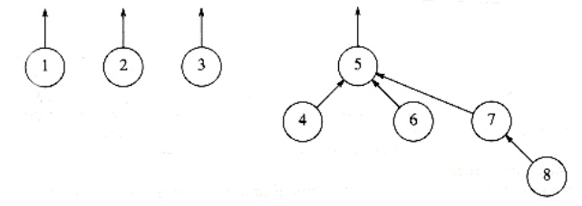
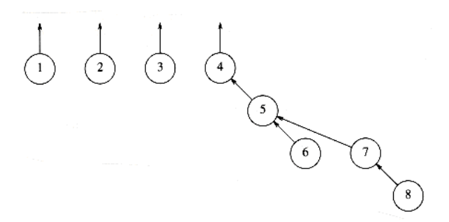
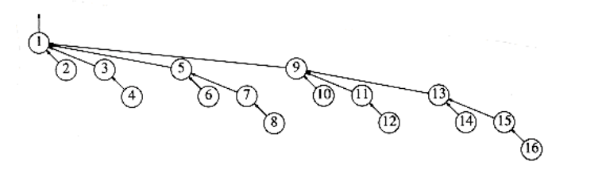
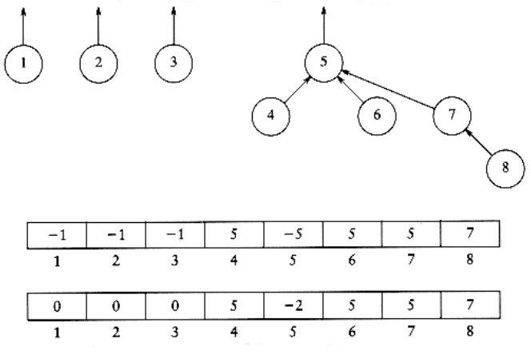

# Smart Union Algorithms

The unions above were performed rather arbitrarily, by making the second tree a subtree of the first. A simple improvement is always to make the smaller tree a subtree of the larger, breaking ties by any method; we call this approach union- by-size. The three unions in the preceding example were all ties, and so we can consider that they were performed by size. If the next operation were union (4, 5), then the forest in Figure 8.10 would form. Had the size heuristic not been used, a deeper forest would have been formed (Fig. 8.11).

**Figure 8.10 Result of union-by-size**

**Figure 8.11 Result of an arbitrary union**

**Figure 8.12 Worst-case tree for n = 16**

We can prove that if unions are done by size, the depth of any node is never more than log n. To see this, note that a node is initially at depth 0. When its depth increases as a result of a union, it is placed in a tree that is at least twice as large as before. Thus, its depth can be increased at most log n times. (We used this argument in the quick-find algorithm at the end of Section 8.2.) This implies that the running time for a find operation is O(log n), and a sequence of m operations takes O(m log n). The tree in Figure 8.12 shows the worst tree possible after 16 unions and is obtained if all unions are between equal-sized trees (the worst-case trees are binomial trees, discussed in Chapter 6).

To implement this strategy, we need to keep track of the size of each tree. Since we are really just using an array, we can have the array entry of each root contain the negative of the size of its tree. Thus, initially the array representation of the tree is all -1s (and Fig 8.7 needs to be changed accordingly). When a union is performed, check the sizes; the new size is the sum of the old. Thus, union-by-size is not at all difficult to implement and requires no extra space. It is also fast, on average. For virtually all reasonable models, it has been shown that a sequence of m operations requires O(m) average time if union-by-size is used. This is because when random unions are performed, generally very small (usually one-element) sets are merged with large sets throughout the algorithm.

An alternative implementation, which also guarantees that all the trees will have depth at most O(log n), is union-by-height. We keep track of the height, instead of the size, of each tree and perform unions by making the shallow tree a subtree of the deeper tree. This is an easy algorithm, since the height of a tree increases only when two equally deep trees are joined (and then the height goes up by one). Thus, union-by-height is a trivial modification of union-by-size.

The following figures show a tree and its implicit representation for both union- by-size and union-by-height. The code in Figure 8.13 implements union-by-height.
