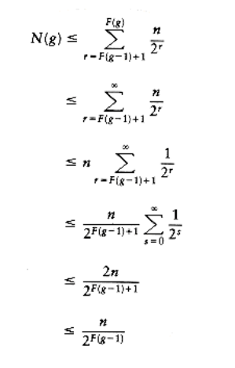

# Worst Case for Union-by-Rank and Path Compression

When both heuristics are used, the algorithm is almost linear in the worst case.

Specifically, the time required in the worst case is (m (m, n)) (provided m, n), where (m, n) is a functional inverse of Ackerman's function, which is defined below:*

A(1, j) = 2j for j 1

A(i, 1) = A(i - 1, 2) for i 2

A(i, j) = A(i - 1,A(i, j - 1)) for i, j 2

**Ackerman's function is frequently defined with A(1, j) = j + 1 for j 1. the form in this text grows faster; thus, the inverse grows more slowly.**

From this, we define

(m, n) = min{i 1|A(i, m/ n) > log n}

You may want to compute some values, but for all practical purposes, (m, n) 4, which is all that is really important here. The single-variable inverse Ackerman function, sometimes written as log\*n, is the number of times the logarithm of n needs to be applied until n 1. Thus, log\* 65536 = 4, because log log log log 65536 = 1. log\* 265536 = 5, but keep in mind that 265536 is a 20,000-digit number. (m, n) actually grows even slower then log\* n. However, (m, n) is not a constant, so the running time is not linear.

In the remainder of this section, we will prove a slightly weaker result. We will show that any sequence of m = (n) union/find operations takes a total of O(m log* n) running time. The same bound holds if union-by-rank is replaced with union-by-size. This analysis is probably the most complex in the book and one of the first truly complex worst-case analyses ever performed for an algorithm that is essentially trivial to implement.

## Analysis of the Union/Find Algorithm

In this section we establish a fairly tight bound on the running time of a sequence of m = (n) union/find operations. The unions and finds may occur in any order, but unions are done by rank and finds are done with path compression.

We begin by establishing some lemmas concerning the number of nodes of rank r. Intuitively, because of the union-by-rank rule, there are many more nodes of small rank than large rank. In particular, there can be at most one node of rank log n. What we would like to do is to produce as precise a bound as possible on the number of nodes of any particular rank r. Since ranks only change when unions are performed (and then only when the two trees have the same rank), we can prove this bound by ignoring the path compression.

LEMMA 8.1.

When executing a sequence of union instructions, a node of rank r must have 2r descendants (including itself).

PROOF:

By induction. the basis, r = 0, is clearly true. Let T be the tree of rank r with the fewest number of descendants and let x be T's root. Suppose the last union x was involved in was between T1 and T2. Suppose T1's root was x. If T1 had rank r, then T1 would be a tree of height r with fewer descendants than T, which contradicts the assumption that T is the tree with the smallest number of descendants. Hence the rank of T1 r - 1. The rank of T2 rank of T1.

Since T has rank r and the rank could only increase because of T2, it follows that the rank of T2 = r - 1. Then the rank of T1 = r - 1. By the induction hypothesis, each tree has at least 2r-1 descendants, giving a total of 2r and establishing the lemma.

Lemma 8.1 tells us that if no path compression is performed, then any node of rank r must have at least 2r descendants. Path compression can change this, of course, since it can remove descendants from a node. However, when unions are performed, even with path compression, we are using the ranks, which are estimated heights. These ranks behave as though there is no path compression. Thus, when bounding the number of nodes of rank r, path compression can be ignored.

Thus, the next lemma is valid with or without path compression.

LEMMA 8.2.

The number of nodes of rank r is at most n/2r.

PROOF:

Without path compression, each node of rank r is the root of a subtree of at least 2r nodes. No node in the subtree can have rank r. Thus all subtrees of nodes of rank r are disjoint.

Therefore, there are at most n/2r disjoint subtrees and hence n/2r nodes of rank r.

The next lemma seems somewhat obvious, but is crucial in the analysis.

LEMMA 8.3.

At any point in the union/find algorithm, the ranks of the nodes on a path from the left to a root increase monotonically.

PROOF:

The lemma is obvious if there is no path compression (see the example). If, after path compression, some node v is a descendant of w, then clearly v must have been a descendant of w when only unions were considered. Hence the rank of v is less than the rank of w.

Let us summarize the preliminary results. Lemma 8.2 tells us how many nodes can be assigned rank r. Because ranks are assigned only by unions, which have no idea of path compression, Lemma 8.2 is valid at any stage of the union/find algorithm--even in the midst of path compression. Figure 8.16 shows that while there are many nodes of ranks 0 and 1, there are fewer nodes of rank r as r gets larger.

Lemma 8.2 is tight, in the sense that it is possible for there to be n/2r nodes for any rank r. It is slightly loose, because it is not possible for the bound to hold for all ranks r simultaneously. While Lemma 8.2 describes the number of nodes in a rank r, Lemma 8.3 tells us their distribution. As one would expect, the rank of nodes is strictly increasing along the path from a leaf to the root.

We are now ready to prove the main theorem. Our basic idea is as follows: A find on any node v costs time proportional to the number of nodes on the path from v to the root. Let us, then, charge one unit of cost for every node on the path from v to the root for each find. To help us count the charges, we will deposit an imaginary penny into each node on the path. This is strictly an accounting gimmick, which is not part of the program. When the algorithm is over, we collect all the coins that have been deposited; this is the total cost.

As a further accounting gimmick, we deposit both American and Canadian pennies. We will show that during the execution of the algorithm, we can deposit only a certain number of American pennies during each find. We will also show that we can deposit only a certain number of Canadian pennies to each node. Adding these two totals gives us a bound on the total number of pennies that can be deposited.

We now sketch our accounting scheme in a little more detail. We will divide the nodes by their ranks. We then divide the ranks into rank groups. On each find, we will deposit some American coins into the general kitty and some Canadian coins into specific vertices. To compute the total number of Canadian coins deposited, we will compute the deposits per node. By adding up all the deposits for each node in rank r, we will get the total deposits per rank r. Then we will add up all the deposits for each rank r in group g and thereby obtain the total deposits for each rank group g. Finally, we add up all the deposits for each rank group g to obtain the total number of Canadian coins deposited in the forest. Adding this to the number of American coins in the kitty gives us the answer.

We will partition ranks into groups. Ranks r goes into group G(r), and G will be determined later. The largest rank in any rank group g is F(g), where F = G-1 is the inverse of G. The number of ranks in any rank group, g > 0, is thus F(g) - F(g - 1). Clearly G(n) is a very loose upper bound on the largest rank group. As an example, suppose that we partitioned the ranks as in Figure 8.7. In this case, . The largest rank in group g is F(g) = g2, and observe that group g > 0 contains ranks F(g - 1) + 1 through F(g) inclusive. This formula does not apply for rank group 0, so for convenience we will ensure that rank group 0 contains only elements of rank 0. Notice that the groups are made of consecutive ranks.

Figure 8.16 A large disjoint set tree (numbers below nodes are ranks)

As mentioned before, each union instruction takes constant time, as long as each root keeps track of how big its subtrees are. Thus, unions are essentially free, as far as this proof goes.

Each find(i) takes time proportional to the number of vertices on the path from the vertex representing i to the root. We will thus deposit one penny for each vertex on the path. If this is all we do, however, we cannot expect much of a bound, because we are not taking advantage of path compression. Thus, we need to take advantage of path compression in our analysis. We will use fancy accounting.

For each vertex, v, on the path from the vertex representing i to the root, we deposit one penny under one of two accounts:

1. If v is the root, or if the parent of v is the root, or if the parent of v is in a different rank group from v, then charge one unit under this rule. This deposits an American penny into the kitty.

2. Otherwise deposit a Canadian penny into the vertex.

LEMMA 8.4.

For any find (v), the total number of pennies deposited, either into the kitty or into a vertex, is exactly equal to the number of nodes on the path from v to the root.

PROOF:

Obvious.

Thus all we need to do is to sum all the American pennies deposited under rule 1 with all the Canadian pennies deposited under rule 2.

We are doing at most m finds. We need to bound the number of pennies that can be deposited into the kitty during a find.

LEMMA 8.5

Over the entire algorithm, the total deposits of American pennies under rule 1 amount to m(G(n) + 2).

Group Rank

------------------------------

0 0

1 1

2 2,3,4

3 5 through 9

4 10 through 16

i (i-1)2 + 1 through i2

**Figure 8.17 Possible partitioning of ranks into groups**

PROOF:

This is easy. For any find, two American pennies are deposited, because of the root and its child. By Lemma 8.3, the vertices going up the path are monotonically increasing in rank, and since there are at most G(n) rank groups, only G(n) other vertices on the path can qualify as a rule 1 deposit for any particular find. Thus, during any one find, at most G(n) + 2 American pennies can be placed in the kitty. Thus, at most m(G(n) + 2) American pennies can be deposited under rule 1 for a sequence of m finds.

To get a good estimate for all the Canadian deposits under rule 2, we will add up the deposits by vertices instead of by find instructions. If a coin is deposited into vertex v under rule 2, v will be moved by path compression and get a new parent of higher rank than its old parent. (This is where we are using the fact that path compression is being done.) Thus, a vertex v in rank group g > 0 can be moved at most F(g) - F(g - 1) times before its parent gets pushed out of rank group g, since that is the size of the rank group.* After this happens, all future charges to v will go under rule 1.

*This can be reduced by 1. We do not for the sake of clarity; the bound is not improved by being more careful here.

LEMMA 8.6.

The number of vertices, N(g), in rank group g > 0 is at most n/2F(g - 1).

PROOF:

By Lemma 8.2, there are at most n/2r vertices of rank r. Summing over the ranks in group g, we obtain

LEMMA 8.7.

The number of Canadian pennies deposited into all vertices in rank group g is at most nF(g)/2F(g - 1).

PROOF:

Each vertex in the rank group can receive at most F(g) - F(g - 1) F(g) Canadian pennies while its parent stays in its rank group, and Lemma 8.6 tells how many such vertices there are The result is obtained by a simple multiplication.

LEMMA 8.8.

The total deposit under rule 2 is at most n Canadian pennies.

PROOF:

Because rank group 0 contains only elements of rank 0, it cannot contribute to rule 2 charges (it cannot have a parent in the same rank group). The bound is obtained by summing the other rank groups.

Thus we have the deposits under rules 1 and 2. The total is

(8.1)

We still have not specified G(n) or its inverse F(n). Obviously, we are free to choose virtually anything we want, but it makes sense to choose G(n) to minimize the bound above. However, if G(n) is too small, then F(n) will be large, hurting the bound. An apparently good choice is to choose F(i) to be the function recursively defined by F(0) = 0 and F(i) = 2F(i - 1). This gives G(n) = 1 +[log* n]. Figure 8.18 shows how this partitions the ranks. Notice that group 0 contains only rank 0, which we required in the previous lemma. F is very similar to the single-variable Ackerman function, which differs only in the definition of the base case (F(0) = 1).

THEOREM 8.1.

The running time of m unions and finds is O(m log* n).

Group Rank

---------------------------

0 0

1 1

2 2

3 3,4

4 5 through 16

5 17 through 216

6 65537 through 265536

7 truly huge ranks

**Figure 8.18 Actual partitioning of ranks into groups used in the proof**

PROOF:

Plug in the definitions of F and G into Equation (8.1). The total number of American pennies is O (mG(n)) = O(m log* n). The total number of Canadian pennies is Since m = (n), the bound follows.

What the analysis shows is that there are few nodes that could be moved frequently by path compression, and thus the total time spent is relatively small.