# Trees

For large amounts of input, the linear access time of linked lists is prohibitive. In this chapter we look at a simple data structure for which the running time of most operations is O(log n) on average. We also sketch a conceptually simple modification to this data structure that guarantees the above time bound in the worst case and discuss a second modification that essentially gives an O(log n) running time per operation for a long sequence of instructions.

The data structure that we are referring to is known as a binary search tree. Trees in general are very useful abstractions in computer science, so we will discuss their use in other, more general applications. In this chapter, we will

- See how trees are used to implement the file system of several popular operating systems.

- See how trees can be used to evaluate arithmetic expressions.

- Show how to use trees to support searching operations in O(log n) average time, and how to refine these ideas to obtain O(log n) worst-case bounds. We will also see how to implement these operations when the data is stored on a disk.

## Preliminaries

A tree can be defined in several ways. One natural way to define a tree is recursively. A tree is a collection of nodes. The collection can be empty, which is sometimes denoted as A. Otherwise, a tree consists of a distinguished node r, called the root, and zero or more (sub)trees T1, T2, . . . , Tk, each of whose roots are connected by a directed edge to r.

The root of each subtree is said to be a child of r, and r is the parent of each subtree root. Figure 4.1 shows a typical tree using the recursive definition.

From the recursive definition, we find that a tree is a collection of n nodes, one of which is the root, and n - 1 edges. That there are n - 1 edges follows from the fact that each edge connects some node to its parent, and every node except the root has one parent (see Fig. 4.2).


**Figure 4.1 Generic tree**


**Figure 4.2 A tree**

In the tree of Figure 4.2, the root is A. Node F has A as a parent and K, L, and M as children. Each node may have an arbitrary number of children, possibly zero. Nodes with no children are known as leaves; the leaves in the tree above are B, C, H, I, P, Q, K, L, M, and N. Nodes with the same parent are siblings; thus K, L, and M are all siblings. Grandparent and grandchild relations can be defined in a similar manner.

A path from node n1 to nk is defined as a sequence of nodes n1, n2, . . . , nk such that ni is the parent of ni+1 for 1 i < k. The length of this path isthe number of edges on the path, namely k -1. There is a path of length zero from every node to itself. Notice that in a tree there is exactly one path from the root to each node.

For any node ni, the depth of ni is the length of the unique path from the rootto ni. Thus, the root is at depth 0. The height of ni is the longest path from ni to a leaf. Thus all leaves are at height 0. The height of a tree is equal to the height of the root. For the tree in Figure 4.2, E is at depth 1 and height 2; F is at depth 1 and height 1; the height of the tree is 3. The depth of a tree is equal to the depth of the deepest leaf; this is always equal to the height of the tree.

If there is a path from n1 to n2, then n1 is an ancestor of n2 and n2 is a descendant of n1. If n1 n2, then n1 is a proper ancestor of n2 and n2 is aproper descendant of n1.

### Implementation of Trees

One way to implement a tree would be to have in each node, besides its data, a pointer to each child of the node. However, since the number of children per node can vary so greatly and is not known in advance, it might be infeasible to make the children direct links in the data structure, because there would be too much wasted space. The solution is simple: Keep the children of each node in a linked list of tree nodes. The declaration in Figure 4.3 is typical.

```c
typedef struct tree_node *tree_ptr;

struct tree_node
{

element_type element;

tree_ptr first_child;

tree_ptr next_sibling;

};
```

**Figure 4.3 Node declarations for trees**


**Figure 4.4 First child/next sibling representation of the tree shown in Figure 4.2**

Figure 4.4 shows how a tree might be represented in this implementation. Arrows that point downward are first_child pointers. Arrows that go left to right are next_sibling pointers. Null pointers are not drawn, because there are too many.

In the tree of Figure 4.4, node E has both a pointer to a sibling (F) and a pointer to a child (I), while some nodes have neither.

### Tree Traversals with an Application

There are many applications for trees. One of the popular uses is the directory structure in many common operating systems, including **UNIX, VAX/VMS,** and **DOS**. Figure 4.5 is a typical directory in the **UNIX** file system.

The root of this directory is /usr. (The asterisk next to the name indicates that /usr is itself a directory.) /usr has three children, mark, alex, and bill, which are themselves directories. Thus, /usr contains three directories and no regular files. The filename /usr/mark/book/ch1.r is obtained by following the leftmost child three times. Each / after the first indicates an edge; the result is the full pathname. This hierarchical file system is very popular, because it allows users to organize their data logically. Furthermore, two files in different directories can share the same name, because they must have different paths from the root and thus have different pathnames. A directory in the **UNIX** file system is just a file with a list of all its children, so the directoriesare structured almost exactly in accordance with the type declaration above.* Indeed, if the normal command to print a file is applied to a directory, then the names of the files in the directory can be seen in the output (along with other non **-ASCII** information).

*Each directory in the UNIX file system also has one entry that points to itself and another entry that points to the parent of the directory. Thus, technically, the UNIX file system is not a tree, but is treelike.


**Figure 4.5 UNIX directory**
```c
void list_directory (Directory_or_file D)
{

list_dir (D, 0);

}

void list_dir (Directory_or_file D, unsigned int depth)
{

/*1*/ if (D is a legitimate entry)
{

/*2*/ print_name (depth, D);

/*3*/ if(D is a directory)
/*4*/ for each child, c, of D

/*5*/ list_dir(c, depth+1);

}

}
```
**Figure 4.6 Routine to list a directory in a hierarchical file system**

Suppose we would like to list the names of all of the files in the directory. Our output format will be that files that are depth d will have their names indented by d tabs. Our algorithm is given in Figure 4.6.

The heart of the algorithm is the recursive procedure list_dir. This routine needs to be started with the directory name and a depth of 0, to signify no indenting for the root. This depth is an internal bookkeeping variable, and is hardly a parameter that a calling routine should be expected to know about. Thus the driver routine list_directory is used to interface the recursive routine to the outside world.

The logic of the algorithm is simple to follow. The argument to list_dir is some sort of pointer into the tree. As long as the pointer is valid, the name implied by the pointer is printed out with the appropriate number of tabs. If the entry is a directory, then we process all children recursively, one by one. These children are one level deeper, and thus need to be indented an extra space. The output is in Figure 4.7.

This traversal strategy is known as a preorder traversal. In a preorder traversal, work at a node is performed before (pre) its children are processed. When this program is run, it is clear that line 2 is executed exactly once per node, since each name is output once. Since line 2 is executed at most once per node, line 3 must also be executed once per node. Furthermore, line 5 can be executed at most once for each child of each node. But the number of children is exactly one less than the number of nodes. Finally, the for loop iterates once per execution of line 5, plus once each time the loop ends. Each for loop terminates on a NULL pointer, but there is at most one of those per node. Thus, the total amount of work is constant per node. If there are n file names to be output, then the running time is O(n).

**Figure 4.7 The (preorder) directory listing**

Another common method of traversing a tree is the postorder traversal. In a postorder traversal, the work at a node is performed after (post) its children are evaluated. As an example, Figure 4.8 represents the same directory structure as before, with the numbers in parentheses representing the number of disk blocks taken up by each file.

Since the directories are themselves files, they have sizes too. Suppose we would like to calculate the total number of blocks used by all the files in the tree. The most natural way to do this would be to find the number of blocks contained in the subdirectories /usr/mark (30), /usr/alex (9), and /usr/bill (32). The total number of blocks is then the total in the subdirectories (71) plus the one block used by /usr, for a total of 72. The function size_directory in Figure 4.9 implements this strategy.


**Figure 4.8 UNIX directory with file sizes obtained via postorder traversal**
```c
unsigned int

size_directory(Directory_or_file D)
{

unsigned int total_size;

/*1*/ total_size = 0;

/*2*/ if(D is a legitimate entry){

/*3*/ total_size = file_size(D);

/*4*/ if(D is a directory)
/*5*/ for each child, c, of D

/*6*/ total_size += size_directory(c);

}

/*7*/ return(total_size);

}
```
**Figure 4.9 Routine to calculate the size of a directory**

            ch1.r                 3

            ch2.r                 2

            ch3.r                 4

        book                      10

           syl.r                  1 

             fall88               2

           syl.r                  5

              spr89               6

           syl.r                  2

              sum89               3

          cop3530                 12

          course                  13

          junk.c                  6

     mark                         30

         junk.c                   8

     alex                         9

         work                     1

                  grades          3

                  prog1.r         4

                  prog2.r         1

               fall88             9

                  prog2.r         2

                  prog1.r         7

                  grades          9

             fall89               19

         cop3212                  29

    course                        30

   bill                           32

/usr                              72


**Figure 4.10 Trace of the size function**

If D is not a directory, then size_directory merely returns the number of blocks used by D. Otherwise, the number of blocks used by D is added to the number of blocks (recursively) found in all of the children. To see the difference between the postorder traversal strategy and the preorder traversal strategy, Figure 4.10 shows how the size of each directory or file is produced by the algorithm.

## Binary Trees

A binary tree is a tree in which no node can have more than two children.

Figure 4.11 shows that a binary tree consists of a root and two subtrees, Tl and Tr, both of which could possibly be empty.

A property of a binary tree that is sometimes important is that the depth of an average binary tree is considerably smaller than n. An analysis shows that the average depth is , and that for a special type of binary tree, namely the binary search tree, the average value of the depth is O(log n). Unfortunately, the depth can be as large as n -1, as the example in Figure 4.12 shows.

**Figure 4.11 Generic binary tree**

**Figure 4.12 Worst-case binary tree**

### Implementation

Because a binary tree has at most two children, we can keep direct pointers to them. The declaration of tree nodes is similar in structure to that for doubly linked lists, in that a node is a structure consisting of the key information plus two pointers (left and right) to other nodes see Many of the rules that apply to linked lists will apply to trees as well. In particular, when an insertion is performed, a node will have to be created by a call to malloc. Nodes can be freed after deletion by calling free.

```c
typedef struct tree_node *tree_ptr;

struct tree_node
{

element_type element;tree_ptr left;

tree_ptr right;

};

typedef tree_ptr TREE;
```
**Figure 4.13 Binary tree node declarations**

We could draw the binary trees using the rectangular boxes that are customary for linked lists, but trees are generally drawn as circles connected by lines, because they are actually graphs. We also do not explicitly draw NULL pointers when referring to trees, because every binary tree with n nodes would require n + 1 NULL pointers.

Binary trees have many important uses not associated with searching. One of the principal uses of binary trees is in the area of compiler design, which we will now explore.

### Expression Trees

Figure 4.14 shows an example of an expression tree. The leaves of an expression tree are operands, such as constants or variable names, and the other nodes contain operators. This particular tree happens to be binary, because all of the operations are binary, and although this is the simplest case, it is possible for nodes to have more than two children. It is also possible for a node to have only one child, as is the case with the unary minus operator. We can evaluate an expression tree, T, by applying the operator at the root to the values obtained by recursively evaluating the left and right subtrees. In our example, the left subtree evaluates to a + (b * c) and the right subtree evaluates to ((d *e) + f) *g. The entire tree therefore represents (a + (b*c)) + (((d * e) + f)* g).

We can produce an (overly parenthesized) infix expression by recursively producing a parenthesized left expression, then printing out the operator at the root, and finally recursively producing a parenthesized right expression. This general strattegy (left, node, right) is known as an inorder traversal; it is easy to remember because of the type of expression it produces.

An alternate traversal strategy is to recursively print out the left subtree, the right subtree, and then the operator. If we apply this strategy to our tree above, the output is a b c * + d e * f + g * +, which is easily seen to be the postfix representation of Section 3.3.3. This traversal strategy is generally known as a postorder traversal. We have seen this traversal strategy earlier in Section 4.1.


**Figure 4.14 Expression tree for (a + b * c) + ((d * e + f) * g)**

A third traversal strategy is to print out the operator first and then recursively print out the left and right subtrees. The resulting expression, + + a * b c * + * d e f g, is the less useful prefix notation and the traversal strategy is a preorder traversal, which we have also seen earlier in Section 4.1. We will return to these traversal strategies once again later in the chapter.

**Constructing an Expression Tree**

We now give an algorithm to convert a postfix expression into an expression tree. Since we already have an algorithm to convert infix to postfix, we can generate expression trees from the two common types of input. The method we describe strongly resembles the postfix evaluation algorithm of Section 3.2.3. We read our expression one symbol at a time. If the symbol is an operand, we create a one- node tree and push a pointer to it onto a stack. If the symbol is an operator, we pop pointers to two trees *T1* and *T2* from the stack (T1 is popped first) and form a new tree whose root is the operator and whose left and right children point to *T2* and *T1* respectively. A pointer to this new tree is then pushed onto the stack.

As an example, suppose the input is a b + c d e + * *

The first two symbols are operands, so we create one-node trees and push pointers to them onto a stack.*

*For convenience, we will have the stack grow from left to right in the diagrams.


Next, a '+' is read, so two pointers to trees are popped, a new tree is formed,


and a pointer to it is pushed onto the stack.*

Next, c, d, and e are read, and for each a one-node tree is created and a pointer to the corresponding tree is pushed onto the stack.


Now a '+' is read, so two trees are merged.


Continuing, a '\*' is read, so we pop two tree pointers and form a new tree with a '*' as root.
  


Finally, the last symbol is read, two trees are merged, and a pointer to the final tree is left on the stack.


## The Search Tree ADT-Binary Search Trees

An important application of binary trees is their use in searching. Let us assume that each node in the tree is assigned a key value. In our examples, we will assume for simplicity that these are integers, although arbitrarily complex keys are allowed. We will also assume that all the keys are distinct, and deal with duplicates later.

The property that makes a binary tree into a binary search tree is that for every node, X, in the tree, the values of all the keys in the left subtree are smaller than the key value in X, and the values of all the keys in the right subtree are larger than the key value in X. Notice that this implies that all the elements in the tree can be ordered in some consistent manner. In Figure 4.15, the tree on the left is a binary search tree, but the tree on the right is not. The tree on the right has a node with key 7 in the left subtree of a node with key 6 (which happens to be the root).

We now give brief descriptions of the operations that are usually performed on binary search trees. Note that because of the recursive definition of trees, it is common to write these routines recursively. Because the average depth of a binary search tree is O(log n), we generally do not need to worry about running out of stack space. We repeat our type definition in Figure 4.16. Since all the elements can be ordered, we will assume that the operators <, >, and = can be applied to them, even if this might be syntactically erroneous for some types.


**Figure 4.15 Two binary trees (only the left tree is a search tree)**
```c
typedef struct tree_node *tree_ptr;

struct tree_node{

element_type element;

tree_ptr left;

tree_ptr right;

};

typedef tree_ptr SEARCH_TREE;
```
**Figure 4.16 Binary search tree declarations**

### Make_null

This operation is mainly for initialization. Some programmers prefer to initialize the first element as a one-node tree, but our implementation follows the recursive definition of trees more closely. It is also a simple routine, as evidenced by Figure 4.17.

### Find

This operation generally requires returning a pointer to the node in tree T that has key x, or NULL if there is no such node. The structure of the tree makes this simple. If T is , then we can just return . Otherwise, if the key stored at T is x, we can return T. Otherwise, we make a recursive call on a subtree of T, either left or right, depending on the relationship of x to the key stored in T. The code in Figure 4.18 is an implementation of this strategy.
```c
SEARCH_TREE

make_null (void)
{

return NULL;

}
```
**Figure 4.17 Routine to make an empty tree**
```c
tree_ptr

find(element_type x, SEARCH_TREE T)
{

if(T == NULL)
return NULL;

if(x < T->element)
return(find(x, T->left));

else
if(x > T->element)
return(find(x, T->right));

else
return T;

}
```
**Figure 4.18 Find operation for binary search trees**

Notice the order of the tests. It is crucial that the test for an empty tree be performed first, since otherwise the indirections would be on a NULL pointer. The remaining tests are arranged with the least likely case last. Also note that both recursive calls are actually tail recursions and can be easily removed with an assignment and a goto. The use of tail recursion is justifiable here because the simplicity of algorithmic expression compensates for the decrease in speed, and the amount of stack space used is expected to be only O(log n).

### Find_min and find_max

These routines return the position of the smallest and largest elements in the tree, respectively. Although returning the exact values of these elements might seem more reasonable, this would be inconsistent with the find operation. It is important that similar-looking operations do similar things. To perform a find_min, start at the root and go left as long as there is a left child. The stopping point is the smallest element. The find_max routine is the same, except that branching is to the right child.

This is so easy that many programmers do not bother using recursion. We will code the routines both ways by doing find_min recursively and find_max nonrecursively (see Figs. 4.19 and 4.20).

Notice how we carefully handle the degenerate case of an empty tree. Although this is always important to do, it is especially crucial in recursive programs. Also notice that it is safe to change T in find_max, since we are only working with a copy. Always be extremely careful, however, because a statement such as T -> right : =T -> right -> right will make changes in most languages.
```c
tree_ptr

find_min(SEARCH_TREE T)
{

if(T == NULL)
return NULL;

else
if(T->left == NULL)
return(T);

else
return(find_min (T->left));

}
```
**Figure 4.19 Recursive implementation of find_min for binary search trees**
```c
tree_ptr

find_max(SEARCH_TREE T)
{

if(T != NULL)
while(T->right != NULL)

T = T->right;

return T;}
```
**Figure 4.20 Nonrecursive implementation of find_max for binary search trees**

### Insert

The insertion routine is conceptually simple. To insert x into tree T, proceed down the tree as you would with a find. If x is found, do nothing (or "update" something). Otherwise, insert x at the last spot on the path traversed. Figure 4.21 shows what happens. To insert 5, we traverse the tree as though a find were occurring. At the node with key 4, we need to go right, but there is no subtree, so 5 is not in the tree, and this is the correct spot.

Duplicates can be handled by keeping an extra field in the node record indicating the frequency of occurrence. This adds some extra space to the entire tree, but is better than putting duplicates in the tree (which tends to make the tree very deep). Of course this strategy does not work if the key is only part of a larger record. If that is the case, then we can keep all of the records that have the same key in an auxiliary data structure, such as a list or another search tree.


**Figure 4.21 Binary search trees before and after inserting 5**

Figure 4.22 shows the code for the insertion routine. Since T points to the root of the tree, and the root changes on the first insertion, insert is written as a function that returns a pointer to the root of the new tree. Lines 8 and 10 recursively insert and attach x into the appropriate subtree.
```c
tree_ptr

insert(element_type x, SEARCH_TREE T)
{

/*1*/ if(T == NULL){ /* Create and return a one-node tree */

/*2*/ T = (SEARCH_TREE) malloc (sizeof (struct tree_node));

/*3*/ if(T == NULL)/*4*/ fatal_error("Out of space!!!");

else{

/*5*/ T->element = x;

/*6*/ T->left = T->right = NULL;

}

}

else
/*7*/ if(x < T->element)
/*8*/ T->left = insert(x, T->left);

else
/*9*/ if(x > T->element)
/*10*/ T->right = insert(x, T->right);

/* else x is in the tree already. We'll do nothing */

/*11*/ return T; /* Don't forget this line!! */

}
```
**Figure 4.22 Insertion into a binary search tree**

### Delete

As is common with many data structures, the hardest operation is deletion. Once we have found the node to be deleted, we need to consider several possibilities.

If the node is a leaf, it can be deleted immediately. If the node has one child, the node can be deleted after its parent adjusts a pointer to bypass the node (we will draw the pointer directions explicitly for clarity). See Figure 4.23. Notice that the deleted node is now unreferenced and can be disposed of only if a pointer to it has been saved.

The complicated case deals with a node with two children. The general strategy is to replace the key of this node with the smallest key of the right subtree (which is easily found) and recursively delete that node (which is now empty). Because the smallest node in the right subtree cannot have a left child, the second delete is an easy one. Figure 4.24 shows an initial tree and the result of a deletion. The node to be deleted is the left child of the root; the key value is 2. It is replaced with the smallest key in its right subtree (3), and then that node is deleted as before.


**Figure 4.23 Deletion of a node (4) with one child, before and after**


**Figure 4.24 Deletion of a node (2) with two children, before and after**

The code in Figure 4.25 performs deletion. It is inefficient, because it makes two passes down the tree to find and delete the smallest node in the right subtree when this is appropriate. It is easy to remove this inefficiency, by writing a special delete_min function, and we have left it in only for simplicity.

If the number of deletions is expected to be small, then a popular strategy to use is lazy deletion: When an element is to be deleted, it is left in the tree and merely marked as being deleted. This is especially popular if duplicate keys are present, because then the field that keeps count of the frequency of appearance can be decremented. If the number of real nodes in the tree is the same as the number of "deleted" nodes, then the depth of the tree is only expected to go up by a small constant (why?), so there is a very small time penalty associated with lazy deletion. Also, if a deleted key is reinserted, the overhead of allocating a new cell is avoided.
```c
tree_ptr

delete(element_type x, SEARCH_TREE T)
{

tree_ptr tmp_cell, child;

if(T == NULL)
error("Element not found");

else
if(x < T->element) /* Go left */

T->left = delete(x, T->left);

else
if(x > T->element) /* Go right */

T->right = delete(x, T->right);

else /* Found element to be deleted */

if(T->left && T->right) /* Two children */
{ /* Replace with smallest in right subtree */

tmp_cell = find_min(T->right);

T->element = tmp_cell->element;

T->right = delete(T->element, T->right);

}

else /* One child */

}

tmp_cell = T;

if(T->left == NULL) /* Only a right child */

child = T->right;

if(T->right == NULL) /* Only a left child */

child = T->left;

free(tmp_cell);

return child;

}

return T;

}
```
**Figure 4.25 Deletion routine for binary search trees**

### Average-Case Analysis

Intuitively, we expect that all of the operations of the previous section, except make_null, should take O(log n) time, because in constant time we descend a level in the tree, thus operating on a tree that is now roughly half as large. Indeed, the running time of all the operations, except make_null, is O(d), where d is the depth of the node containing the accessed key.

We prove in this section that the average depth over all nodes in a tree is O(log n) on the assumption that all trees are equally likely.

The sum of the depths of all nodes in a tree is known as the internal path length. We will now calculate the average internal path length of a binary search tree, where the average is taken over all possible binary search trees.

Let D(n) be the internal path length for some tree T of n nodes. D(1) = 0. An n- node tree consists of an i-node left subtree and an (n - i - 1)-node right

subtree, plus a root at depth zero for 0 i < n. D(i) is the internal path length of the left subtree with respect to its root. In the main tree, all these nodes are one level deeper. The same holds for the right subtree. Thus, we get the recurrence

D(n) = D(i) + D(n - i -1) + n -1

If all subtree sizes are equally likely, which is true for binary search trees (since the subtree size depends only on the relative rank of the first element inserted into the tree), but not binary trees, then the average value of both D

(i) and D(n - i -1) is    . This yields


This recurrence will be encountered and solved in Chapter 7, obtaining an average value of D(n) = O(n log n). Thus, the expected depth of any node is O(log n). As an example, the randomly generated 500-node tree shown in Figure 4.26 has nodes at expected depth 9.98.

It is tempting to say immediately that this result implies that the average running time of all the operations discussed in the previous section is O(log n), but this is not entirely true. The reason for this is that because of deletions, it is not clear that all binary search trees are equally likely. In particular, the deletion algorithm described above favors making the left subtrees deeper than the right, because we are always replacing a deleted node with a node from the right subtree. The exact effect of this strategy is still unknown, but it seems only to be a theoretical novelty. It has been shown that if we alternate insertions and deletions (n2) times, then the trees will have an expected depth of . After a quarter-million random insert/delete pairs, the tree that was somewhat right-heavy in Figure 4.26 looks decidedly unbalanced (averagedepth = 12.51). See Figure 4.27.


**Figure 4.26 A randomly generated binary search tree**

We could try to eliminate the problem by randomly choosing between the smallest element in the right subtree and the largest in the left when replacing the deleted element. This apparently eliminates the bias and should keep the trees balanced, but nobody has actually proved this. In any event, this phenomenon appears to be mostly a theoretical novelty, because the effect does not show up at all for small trees, and stranger still, if o(n2) insert/delete pairs are used, then the tree seems to gain balance!


**Figure 4.27 Binary search tree after O(n2) insert/delete pairs**

The main point of this discussion is that deciding what "average" means is generally extremely difficult and can require assumptions which may or may not be valid. In the absence of deletions, or when lazy deletion is used, it can be shown that all binary search trees are equally likely and we can conclude that the average running times of the operations above are O(log n). Except forstrange cases like the one discussed above, this result is very consistent with observed behavior.

If the input comes into a tree presorted, then a series of inserts will take quadratic time and give a very expensive implementation of a linked list, since the tree will consist only of nodes with no left children. One solution to the problem is to insist on an extra structural condition called balance: no node is allowed to get too deep.

There are quite a few general algorithms to implement balanced trees. Most are quite a bit more complicated than a standard binary search tree, and all take longer on average. They do, however, provide protection against the embarrassingly simple cases. Below, we will sketch one of the oldest forms of balanced search trees, the **AVL** tree.

A second, newer, method is to forego the balance condition and allow the tree to be arbitrarily deep, but after every operation, a restructuring rule is applied that tends to make future operations efficient. These types of data structures are generally classified as self-adjusting. In the case of a binary search tree, we can no longer guarantee an O(log n) bound on any single operation, but can show that any sequence of m operations takes total time O(m log n) in the worst case. This is generally sufficient protection against a bad worst case. The data structure we will discuss is known as a splay tree; its analysis is fairly intricate and is discussed in Chapter 11.

## AVL Trees

An AVL (Adelson-Velskii and Landis) tree is a binary search tree with a balance condition. The balance condition must be easy to maintain, and it ensures that the depth of the tree is O(log n). The simplest idea is to require that the left and right subtrees have the same height. As Figure 4.28 shows, this idea does not force the tree to be shallow.


**Figure 4.28 A bad binary tree. Requiring balance at the root is not enough.**

Another balance condition would insist that every node must have left and right subtrees of the same height. If the height of an empty subtree is defined to be -1 (as is usual), then only perfectly balanced trees of 2k - 1 nodes would satisfy this criterion. Thus, although this guarantees trees of small depth, the balance condition is too rigid to be useful and needs to be relaxed.An **AVL** tree is identical to a binary search tree, except that for every node in the tree, the height of the left and right subtrees can differ by at most 1. (The height of an empty tree is defined to be -1.) In Figure 4.29 the tree on the left is an **AVL** tree, but the tree on the right is not. Height information is kept for each node (in the node structure). It is easy to show that the height of an **AVL** tree is at most roughly 1.44 log(n + 2) - .328, but in practice it is about log(n + 1) + 0.25 (although the latter claim has not been proven). As an example, the **AVL** tree of height 9 with the fewest nodes (143) is shown in Figure 4.30. This tree has as a left subtree an **AVL** tree of height 7 of minimum size. The right subtree is an **AVL** tree of height 8 of minimum size. This tells us that the minimum number of nodes, N(h), in an **AVL** tree of height h is given by N(h) = N(h -1) + N(h - 2) + 1. For h = 0, N(h) = 1. For h = 1, N(h) = 2. The function N(h) is closely related to the Fibonacci numbers, from which the bound claimed above on the height of an **AVL** tree follows.

Thus, all the tree operations can be performed in O(log n) time, except possibly insertion (we will assume lazy deletion). When we do an insertion, we need to update all the balancing information for the nodes on the path back to the root, but the reason that insertion is potentially difficult is that inserting a node could violate the **AVL** tree property. (For instance, inserting into the **AVL** tree in Figure 4.29 would destroy the balance condition at the node with key 8.) If this is the case, then the property has to be restored before the insertion step is considered over. It turns out that this can always be done with a simple modification to the tree, known as a rotation. We describe rotations in the following section.


**Figure 4.29 Two binary search trees. Only the left tree is AVL.**


**Figure 4.30 Smallest AVL tree of height 9**

4.4.1. Single Rotation

4.4.2. Double Rotation

### Single Rotation

The two trees in Figure 4.31 contain the same elements and are both binary search trees. First of all, in both trees k1 < k2. Second, all elements in the subtree X
are smaller than k1 in both trees. Third, all elements in subtree Z are larger than k2. Finally, all elements in subtree Y are in between k1 and k2. The conversion of one of the above trees to the other is known as a rotation. A rotation involves only a few pointer changes (we shall see exactly how many later), and changes the structure of the tree while preserving the search tree property.

The rotation does not have to be done at the root of a tree; it can be done at any node in the tree, since that node is the root of some subtree. It can transform either tree into the other. This gives a simple method to fix up an AVL tree if an insertion causes some node in an AVL tree to lose the balance property: Do a rotation at that node. The basic algorithm is to start at the node inserted and travel up the tree, updating the balance information at every node on the path. If we get to the root without having found any badly balanced nodes, we are done. Otherwise, we do a rotation at the first bad node found, adjust its balance, and are done (we do not have to continue going to the root). In many cases, this is sufficient to rebalance the tree. For instance, in Figure 4.32, after the insertion of the in the original AVL tree on the left, node 8 becomes unbalanced. Thus, we do a single rotation between 7 and 8, obtaining thetree on the right.


**Figure 4.31 Single rotation**


**Figure 4.32 AVL property destroyed by insertion of , then fixed by a rotation**

Let us work through a rather long example. Suppose we start with an initially empty AVL tree and insert the keys 1 through 7 in sequential order. The first problem occurs when it is time to insert key 3, because the AVL property is violated at the root. We perform a single rotation between the root and its right child to fix the problem. The tree is shown in the following figure, before and after the rotation:


To make things clearer, a dashed line indicates the two nodes that are the subject of the rotation. Next, we insert the key 4, which causes no problems, but the insertion of 5 creates a violation at node 3, which is fixed by a single rotation. Besides the local change caused by the rotation, the programmer must remember that the rest of the tree must be informed of this change. Here, this means that 2's right child must be reset to point to 4 instead of 3. This is easy to forget to do and would destroy the tree (4 would be inaccessible).


Next, we insert 6. This causes a balance problem for the root, since its left subtree is of height 0, and its right subtree would be height 2. Therefore, we perform a single rotation at the root between 2 and 4.


The rotation is performed by making 2 a child of 4 and making 4's original left subtree the new right subtree of 2. Every key in this subtree must lie between 2 and 4, so this transformation makes sense. The next key we insert is 7, which causes another rotation.

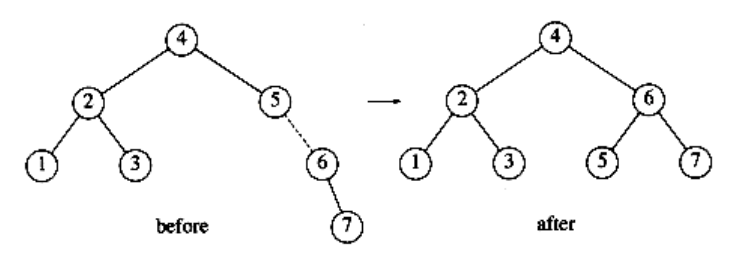

### Double Rotation

The algorithm described in the preceding paragraphs has one problem. There is a case where the rotation does not fix the tree. Continuing our example, suppose we insert keys 8 through 15 in reverse order. Inserting 15 is easy, since it does not destroy the balance property, but inserting 14 causes a height imbalance at node 7.


As the diagram shows, the single rotation has not fixed the height imbalance. The problem is that the height imbalance was caused by a node inserted into the tree containing the middle elements (tree Y in Fig. 4.31) at the same time as the other trees had identical heights. The case is easy to check for, and the solution is called a double rotation, which is similar to a single rotation but involves four subtrees instead of three. In Figure 4.33, the tree on the left is converted to the tree on the right. By the way, the effect is the same as rotating between k1 and k2 and then between k2 and k3. There is a symmetric case, which is also shown (see Fig. 4.34).


**Figure 4.33 (Right-left) double rotation**


**Figure 4.34 (Left-right) double rotation**

In our example, the double rotation is a right-left double rotation and involves 7, 15, and 14. Here, k3 is the node with key 7, k1 is the node with key 15, and k2 is the node with key 14. Subtrees A, B, C, and D are all empty.


Next we insert 13, which requires a double rotation. Here the double rotation is again a right-left double rotation that will involve 6, 14, and 7 and will restore the tree. In this case, k3 is the node with key 6, k1 is the node with key 14, and k2 is the node with key 7. Subtree A is the tree rooted at the node with key 5, subtree B is the empty subtree that was originally the left child of the node with key 7, subtree C is the tree rooted at the node with key 13, and finally, subtree D is the tree rooted at the node with key 15.


If 12 is now inserted, there is an imbalance at the root. Since 12 is not between 4 and 7, we know that the single rotation will work.


Insertion of 11 will require a single rotation:


To insert 10, a single rotation needs to be performed, and the same is true for the subsequent insertion of 9. We insert 8 without a rotation, creating the almost perfectly balanced tree that follows.


Finally, we insert to show the symmetric case of the double rotation.

Notice that causes the node containing 9 to become unbalanced. Since is between 9 and 8 (which is 9's child on the path to , a double rotation needs to be performed, yielding the following tree.


The reader can verify that any imbalance caused by an insertion into an AVL tree can always be fixed by either a single or double rotation. The programming details are fairly straightforward, except that there are several cases. To insert a new node with key x into an AVL tree T, we recursively insert x into the appropriate subtree of T (let us call this Tlr). If the height of Tlr does not change, then we are done. Otherwise, if a height imbalance appears in T, we do the appropriate single or double rotation depending on x and the keys in T and Tlr, update the heights (making the connection from the rest of the tree above), and are done. Since one rotation always suffices, a carefully coded nonrecursive version generally turns out to be significantly faster than the recursive version. However, nonrecursive versions are quite difficult to code correctly, so many programmers implement AVL trees recursively.

Another efficiency issue concerns storage of the height information. Since all that is really required is the difference in height, which is guaranteed to be small, we could get by with two bits (to represent +1, 0, -1) if we really try. Doing so will avoid repetitive calculation of balance factors but results in some loss of clarity. The resulting code is somewhat more complicated than if the height were stored at each node. If a recursive routine is written, then speed is probably not the main consideration. In this case, the slight speed advantage obtained by storing balance factors hardly seems worth the loss of clarity and relative simplicity. Furthermore, since most machines will align this to at least an 8-bit boundary anyway, there is not likely to be any difference in the amount of space used. Eight bits will allow us to store absolute heights of up to 255. Since the tree is balanced, it is inconceivable that this would be insufficient (see the exercises).

With all this, we are ready to write the **AVL** routines. We will do only a partial job and leave the rest as an exercise. First, we need the declarations. These are given in Figure 4.35. We also need a quick function to return the height of a node. This function is necessary to handle the annoying case of a NULL pointer. This is shown in Figure 4.36. The basic insertion routine is easy to write, sinceit consists mostly of function calls (see Fig. 4.37).
```c
typedef struct avl_node *avl_ptr;

struct avl_node
{

element_type element;

avl_ptr left;

avl_ptr right;

int height;

};

typedef avl_ptr SEARCH_TREE;
```
**Figure 4.35 Node declaration for AVL trees**
```c
int

height(avl_ptr p)
{

if(p == NULL)
return -1;

else
return p->height;

}
```
**Figure 4.36 Function to compute height of an AVL node**

For the trees in Figure 4.38, s_rotate_left converts the tree on the left to the tree on the right, returning a pointer to the new root. s_rotate_right is symmetric. The code is shown in Figure 4.39.

The last function we will write will perform the double rotation pictured in Figure 4.40, for which the code is shown in Figure 4.41.

Deletion in **AVL** trees is somewhat more complicated than insertion. Lazy deletion is probably the best strategy if deletions are relatively infrequent.

## Splay Trees

We now describe a relatively simple data structure, known as a splay tree, that guarantees that any m consecutive tree operations take at most O(m log n) time.Although this guarantee does not preclude the possibility that any single operation might take O(n) time, and thus the bound is not as strong as an O(log n) worst-case bound per operation, the net effect is the same: There are no bad input sequences. Generally, when a sequence of m operations has total worst-case running time of O(m f(n)), we say that the amortized running time is O(f(n)). Thus, a splay tree has O(log n) amortized cost per operation. Over a long sequence of operations, some may take more, some less.

Splay trees are based on the fact that the O(n) worst-case time per operation for binary search trees is not bad, as long at it occurs relatively infrequently. Any one access, even if it takes O(n), is still likely to be extremely fast. The problem with binary search trees is that it is possible, and not uncommon, for a whole sequence of bad accesses to take place. The cumulative running time then becomes noticeable. A search tree data structure with O(n) worst-case time, but a guarantee of at most O(m log n) for any m consecutive operations, is certainly satisfactory, because there are no bad sequences.

If any particular operation is allowed to have an O(n) worst-case time bound, and we still want an O(log n) amortized time bound, then it is clear that whenever a node is accessed, it must be moved. Otherwise, once we find a deep node, we could keep performing finds on it. If the node does not change location, and each access costs O(n), then a sequence of m accesses will cost O(m n).
```c
SEARCH_TREE

insert(element_type x, SEARCH_TREE T)
{

return insert1(x, T, NULL);

}

SEARCH_TREE

insert1(element_type x, SEARCH_TREE T, avl_ptr parent)
{

avl_ptr rotated_tree;

if(T == NULL){ /* Create and return a one-node tree */

T = (SEARCH_TREE) malloc (sizeof (struct avl_node));

if(T == NULL)
fatal_error("Out of space!!!");

else{T->element = x; T->height = 0;

T->left = T->right = NULL;

}

}

else{

if(x < T->element){

T->left = insert1(x, T->left, T);

if(height(T->left) - height(T->right)) == 2
{

if(x < T->left->element)
rotated_tree = s_rotate_left(T);

else
rotated_tree = d_rotate_left(T);

if(parent->left == T)
parent->left = rotated_tree;

else
parent->right = rotated_tree;

}

else
T->height = max(height(T->left), height(T->right)) + 1;

}

else
/* Symmetric Case for right subtree */;

/* Else x is in the tree already. We'll do nothing */

}

return T;

}
```
**Figure 4.37 Insertion into an AVL tree**

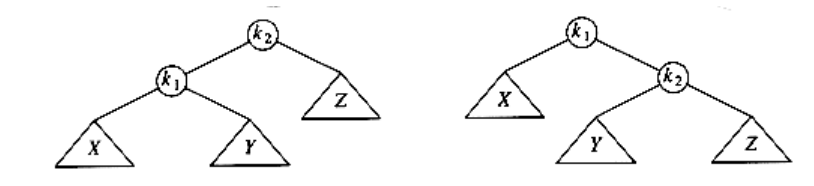

**Figure 4.38**
```c
/* This function can be called only if k2 has a left child. */

/* Perform a rotate between a node (k2) and its left child. */

/* Update heights. */

/* Then return new root. */

avl_ptr

s_rotate_left(avl_ptr k2)
{

avl_ptr k1;

k1 = k2->left;

k2->left = k1->right;

k1->right = k2;

k2->height = max(height(k2->left), height(k2->right)) + 1;

k1->height = max(height(k1->left), k2->height) + 1;

return k1; /* New root */

}
```
**Figure 4.39 Routine to perform single rotation**

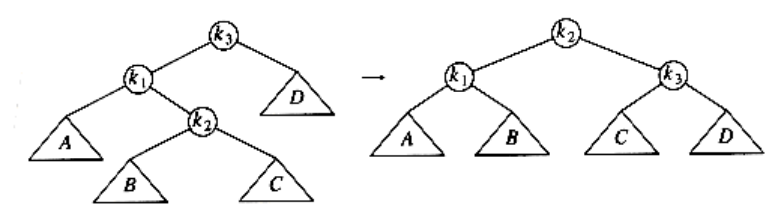

**Figure 4.40**
```c
/* This function can be called only if k3 has a left child */

/* and k3's left child has a right child */

/* Do the left-right double rotation. Update heights */

avl_ptr

d_rotate_left(avl_ptr k3)
{

/* rotate between k1 and k2 */

k3->left = s_rotate_right(k3->left);

/* rotate between k3 and k2 */

return(s_rotate_left(k3));

}
```
**Figure 4.41 Routine to perform double rotation**

The basic idea of the splay tree is that after a node is accessed, it is pushed to the root by a series of **AVL** tree rotations. Notice that if a node is deep, there are many nodes on the path that are also relatively deep, and by restructuring we can make future accesses cheaper on all these nodes. Thus, if the node is unduly deep, then we want this restructuring to have the side effect of balancing the tree (to some extent). Besides giving a good time bound in theory, this method is likely to have practical utility, because in many applications when a node is accessed, it is likely to be accessed again in the near future. Studies have shown that this happens much more often than one would expect. Splay trees also do not require the maintenance of height or balance information, thus saving space and simplifying the code to some extent (especially when careful implementations are written).

### A Simple Idea (That Does Not Work)

One way of performing the restructuring described above is to perform single rotations, bottom up. This means that we rotate every node on the access path with its parent. As an example, consider what happens after an access (a find) on k1 in the following tree.

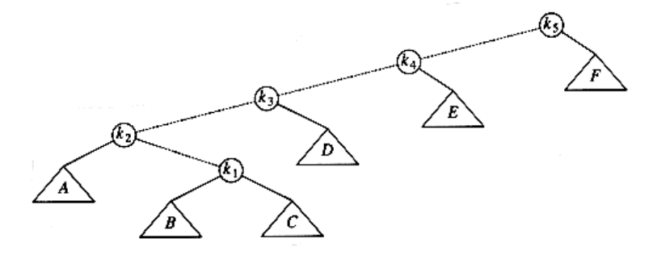

The access path is dashed. First, we would perform a single rotation between k1  and its parent, obtaining the following tree.

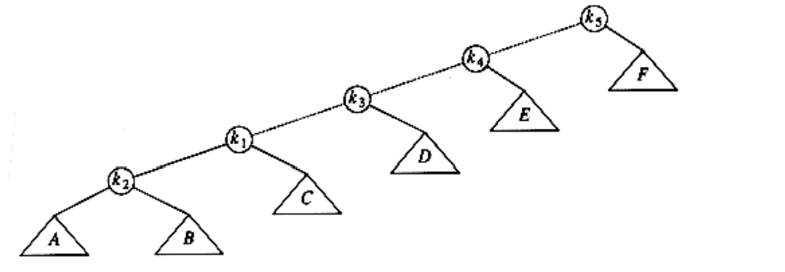

Then, we rotate between k1 and k3, obtaining the next tree.

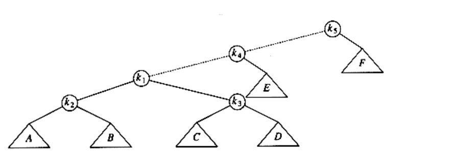

Then two more rotations are performed until we reach the root.

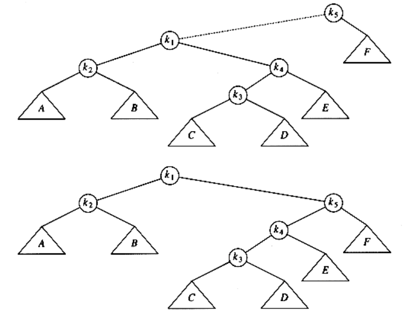

These rotations have the effect of pushing k1 all the way to the root, so that future accesses on k1 are easy (for a while). Unfortunately, it has pushed another node (k3) almost as deep as k1 used to be. An access on that node will then push another node deep, and so on. Although this strategy makes future accesses of k1 cheaper, it has not significantly improved the situation for the other nodes on the (original) access path. It turns out that it is possible to prove that using this strategy, there is a sequence of m operations requiring

(m n) time, so this idea is not quite good enough. The simplest way to show this is to consider the tree formed by inserting keys 1, 2, 3, . . . , n into an initially empty tree (work this example out). This gives a tree consisting of only left children. This is not necessarily bad, though, since the time to build this tree is O(n) total. The bad part is that accessing the node with key 1 takes n -1 units of time. After the rotations are complete, an access of the node with key 2 takes n - 2 units of time. The total for accessing all the keys in order is . After they are accessed, the tree reverts to its original state, and we can repeat the sequence.

### Splaying

The splaying strategy is similar to the rotation idea above, except that we are a little more selective about how rotations are performed. We will still rotate bottom up along the access path. Let x be a (nonroot) node on the access path at which we are rotating. If the parent of x is the root of the tree, we merely rotate x and the root. This is the last rotation along the access path. Otherwise, x has both a parent (p) and a grandparent (g), and there are twocases, plus symmetries, to consider. The first case is the zig-zag case (see Fig. 4.42). Here x is a right child and p is a left child (or vice versa). If this is the case, we perform a double rotation, exactly like an AVL double rotation. Otherwise, we have a zig-zig case: x and p are either both left children or both right children. In that case, we transform the tree on the left of Figure 4.43 to the tree on the right.

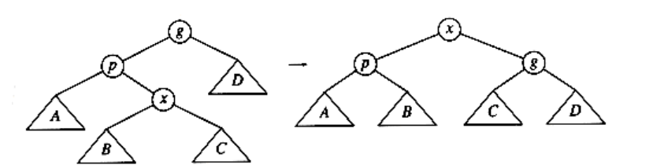

**Figure 4.42 Zig-zag**

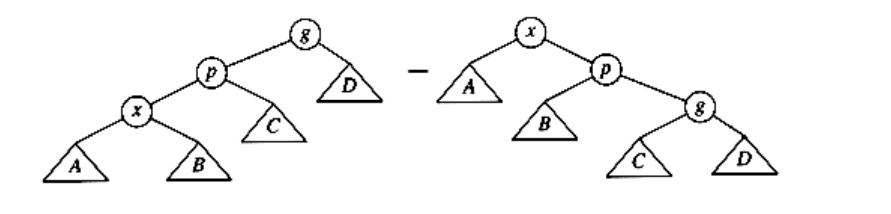

**Figure 4.43 Zig-zig**

As an example, consider the tree from the last example, with a find on k1:

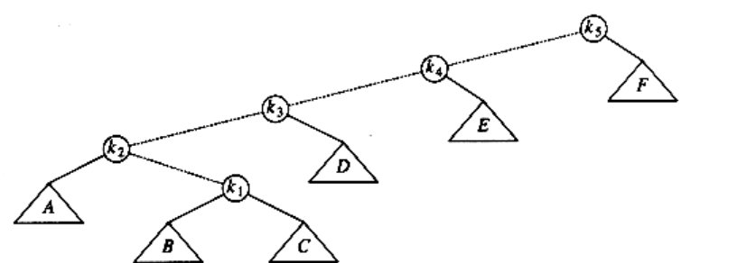

The first splay step is at k1, and is clearly a zig-zag, so we perform a standard **AVL** double rotation using k1, k2, and k3. The resulting tree follows.

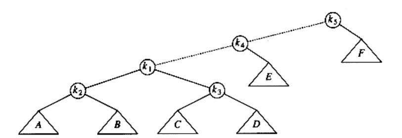

The next splay step at k1 is a zig-zig, so we do the zig-zig rotation with k1,k4, and k5, obtaining the final tree.

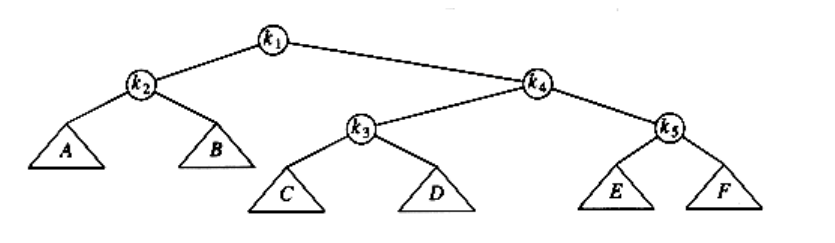

Although it is hard to see from small examples, splaying not only moves the accessed node to the root, but also has the effect of roughly halving the depth of most nodes on the access path (some shallow nodes are pushed down at most two levels).

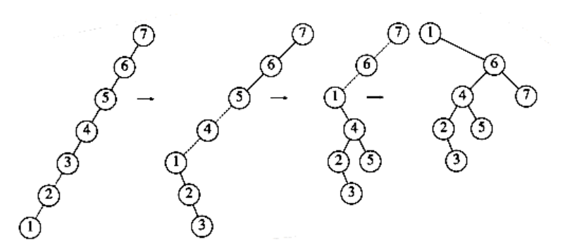


**Figure 4.44 Result of splaying at node 1**

To see the difference that splaying makes over simple rotation, consider again the effect of inserting keys 1, 2, 3, . . . , n into an initially empty tree. This takes a total of O(n), as before, and yields the same tree as simple rotations. Figure 4.44 shows the result of splaying at the node with key 1. The difference is that after an access of the node with key 1, which takes n -1 units, the access on the node with key 2 will only take about n/2 units instead of n - 2 units; there are no nodes quite as deep as before.

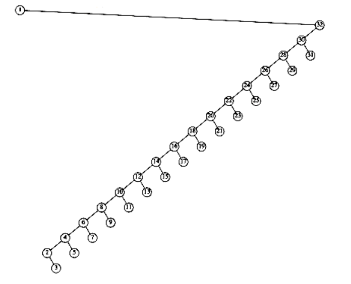


**Figure 4.45 Result of splaying at node 1 a tree of all left children**

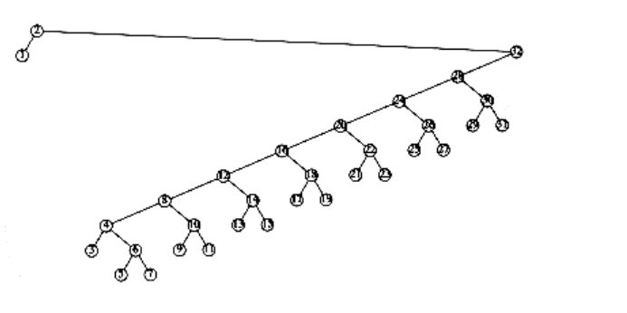


**Figure 4.46 Result of splaying previous tree at node 2**

An access on the node with key 2 will bring nodes to within n/4 of the root, and this is repeated until the depth becomes roughly log n (an example with n = 7 is too small to see the effect well). Figures 4.45 to 4.53 show the result of accessing keys 1 through 9 in a 32-node tree that originally contains only left children. Thus we do not get the same bad behavior from splay trees that is prevalent in the simple rotation strategy. (Actually, this turns out to be a very good case. A rather complicated proof shows that for this example, the n accesses take a total of O(n) time).

These figures show off the fundamental and crucial property of splay trees. When access paths are long, thus leading to a longer-than-normal search time, the rotations tend to be good for future operations. When accesses are cheap, the rotations are not as good and can be bad. The extreme case is the initial tree formed by the insertions. All the insertions were constant-time operations leading to a bad initial tree. At that point in time, we had a very bad tree, butwe were running ahead of schedule and had the compensation of less total running time. Then a couple of really horrible accesses left a nearly balanced tree, but the cost was that we had to give back some of the time that had been saved. The main theorem, which we will prove in Chapter 11, is that we never fall behind a pace of O(log n) per operation: We are always on schedule, even though there are occasionally bad operations.

Because the rotations for splay trees are performed in pairs from the bottom up, a recursive implementation does not work, (although modifications to the splaying steps can be made to allow a recursive implementation). The pairs of nodes to consider are not known until the length of the path is determined to be even or odd. Thus, splay trees are coded nonrecursively and work in two passes. The first pass goes down the tree and the second goes back up, performing rotations. This requires that the path be saved. This can be done by using a stack (which might need to store n pointers) or by adding an extra field to the node record that will point to the parent. Neither method is particularly difficult to implement. We will provide code for the splaying routine on the assumption that each node stores its parent.

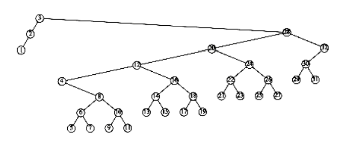


**Figure 4.47 Result of splaying previous tree at node 3**

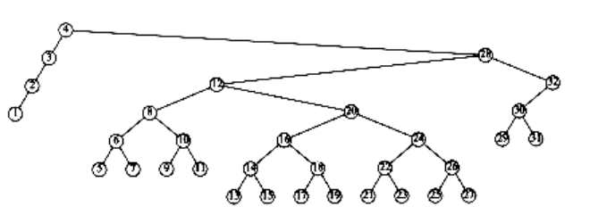

**Figure 4.48 Result of splaying previous tree at node 4**

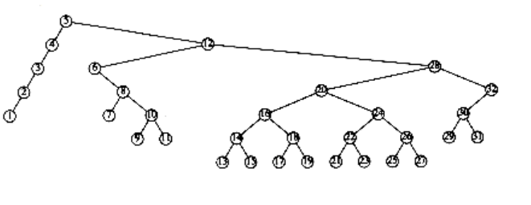

**Figure 4.49 Result of splaying previous tree at node 5**

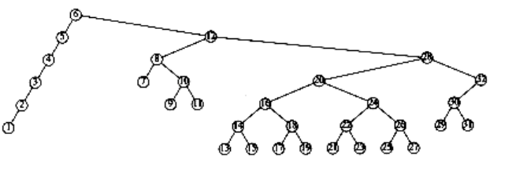

**Figure 4.50 Result of splaying previous tree at node 6**

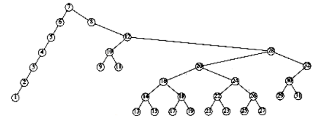

**Figure 4.51 Result of splaying previous tree at node 7**
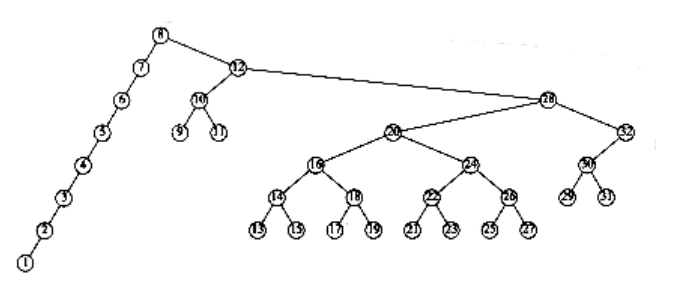

**Figure 4.52 Result of splaying previous tree at node 8**

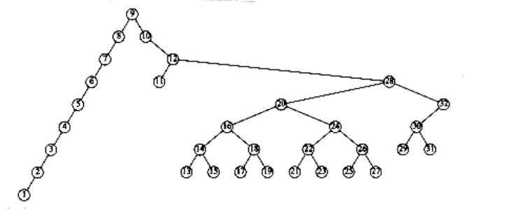

**Figure 4.53 Result of splaying previous tree at node 9**

The type declarations (Fig. 4.54) are simple to understand. The splaying routine (Fig. 4.55) takes as argument the last node on the accessed path and makes it the new root. The routines single_rotate and double_rotate choose the correct type of rotation. We provide the code for single_rotate in Figure 4.56.

The rotation routines are similar to the AVL rotations, except that the parent pointers must be maintained. Some sample routines are in the figures that follow. Since zig rotations always make x the new root, we know that x will have no parent after the operation. The code for this is in Figure 4.57.

Zig-zigs and Zig-zags are similar. We will write the one routine to perform the zig-zig splay when both x and p are left children. One way to do this is to write a single_rotate routine that includes pointer changes for the parent, and then implement the complex rotations with two single rotations. This is the way we coded the AVL routines. We have taken a different approach in Figure 4.58 to show the diversity of styles available. See Figure 4.59. You should try to code the other cases yourself; it will be excellent pointer manipulation practice.
```c
typedef struct splay_node *splay_ptr;

struct splay_node
{

element_type element;

splay_ptr left;

splay-ptr right;

splay-ptr parent;

};

typedef splay_ptr SEARCH_TREE;
```
**Figure 4.54 Type declarations for splay trees**
```c
void splay(splay_ptr current)
{

splay_ptr father;

father = current->parent;

while(father != NULL)
{

if(father->parent == NULL)
single_rotate (current);else
double_rotate(current);

father = current->parent;

}

}
```
**Figure 4.55 Basic splay routine**
```c
void single_rotate(splay_ptr x)
{

if(x->parent->left == x)
zig_left(x);

else
zig_right(x);

}
```
**Figure 4.56 Single rotation**
```c
void zig_left(splay_ptr x)
{

splay ptr p, B;

p = x->parent;

B = x->right;

x->right = p; /* x's new right child is p*/

x->parent = NULL; /* x will now be a root */

if(B != NULL)
B->parent = p;

p->left = B;

p->parent = x;

}
```
**Figure 4.57 Single rotation between root and its left child**

We can perform deletion by accessing the node to be deleted. This puts the node at the root. If it is deleted, we get two subtrees TL and TR (left and right). If we find the largest element in TL (which is easy), then this element is rotated to the root of TL, and TL will now have a root with no right child. We can finish the deletion by making TR the right child.

The analysis of splay trees is difficult, because it must take into account the ever-changing structure of the tree. On the other hand, splay trees are much simpler to program than AVL trees, since there are fewer cases to consider and no balance information to maintain. Our splay tree code may look complicated, but as pointed out before, it can be simplified; it is probably much simpler than a nonrecursive AVL implementation. Some empirical evidence suggests that this translates into faster code in practice, although the case for this is far from complete. Finally, we point out that there are several variations of splay trees that can perform even better in practice.

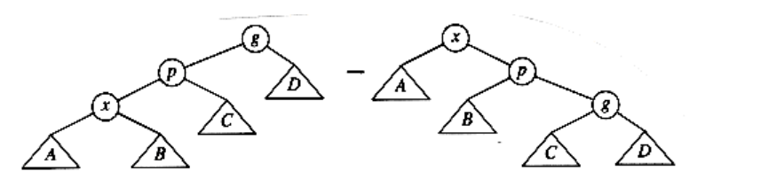
```c
Figure 4.58

void zig_zig_left(splay_ptr x)
{

splay_ptr p, g, B, C, ggp;

p = x->parent;

g = p->parent;

B = x->right;

C = p->right;

ggp = g->parent;

x->right = p; /* x's new right child is p*/

p->parent = x;

p->right = g; /* p's new right child is g */

g->parent = p;if(B != NULL) /* p's new left child is subtree B */

B->parent = p;

p->left = B;

if(C != NULL) /* g's new left child is subtree C */

C->parent = g;

g->left = C;

x->parent = ggp; /* connect to rest of the tree */

if(ggp ! = NULL)
if(gpp->left == g)
ggp->left = x;

else
ggp->right = x;

}
```
**Figure 4.59 Routine to perform a zig-zig when both children are initially left children**

## Tree Traversals (Revisited)

Because of the ordering information in a binary search tree, it is simple to list all the keys in sorted order. The recursive procedure in Figure 4.60 does this.

Convince yourself that this procedure works. As we have seen before, this kind of routine when applied to trees is known as an inorder traversal (which makes sense, since it lists the keys in order). The general strategy of an inorder traversal is to process the left subtree first, then perform processing at the current node, and finally process the right subtree. The interesting part about this algorithm, aside from its simplicity, is that the total running time is O (n). This is because there is constant work being performed at every node in the tree. Each node is visited once, and the work performed at each node is testing against NULL, setting up two procedure calls, and doing a print_element. Since there is constant work per node and n nodes, the running time is O(n).
```c
void print_tree(SEARCH_TREE T)
{

if(T != NULL){print_tree(T->left);

print_element(T->element);

print_tree(T->right);

}

}
```
**Figure 4.60 Routine to print a binary search tree in order**

Sometimes we need to process both subtrees first before we can process a node. For instance, to compute the height of a node, we need to know the height of the subtrees first. The code in Figure 4.61 computes this. Since it is always a good idea to check the special cases - and crucial when recursion is involved - notice that the routine will declare the height of a leaf to be zero, which is correct. This general order of traversal, which we have also seen before, is known as a postorder traversal. Again, the total running time is O(n), because constant work is performed at each node.

The third popular traversal scheme that we have seen is preorder traversal. Here, the node is processed before the children. This could be useful, for example, if you wanted to label each node with its depth.

The common idea in all of these routines is that you handle the NULL case first, and then the rest. Notice the lack of extraneous variables. These routines pass only the tree, and do not declare or pass any extra variables. The more compact the code, the less likely that a silly bug will turn up. A fourth, less often used, traversal (which we have not seen yet) is level-order traversal. In a level-order traveresal, all nodes at depth d are processed before any node at depth d + 1. Level-order traversal differs from the other traversals in that it is not done recursively; a queue is used, instead of the implied stack of recursion.
```
int

height(TREE T)
{

if(T == NULL)
return -1;

else
return (max(height(T->left), height(T->right)) + 1);

}
```
**Figure 4.61 Routine to compute the height of a tree using a postorder traversal**

## B-Trees
Although all of the search trees we have seen so far are binary, there is a popular search tree that is not binary. This tree is known as a B-tree.

A B-tree of order m is a tree with the following structural properties:

- The root is either a leaf or has between 2 and m children.

- All nonleaf nodes (except the root) have between m/2 and m children.

- All leaves are at the same depth.

All data is stored at the leaves. Contained in each interior node are pointers p1, p2, . . . , pm to the children, and values k1, k2, . . . , km - 1, representing the smallest key found in the subtrees p2, p3, . . . , pm respectively. Of course, some of these pointers might be NULL, and the corresponding ki would then be undefined. For every node, all the keys in subtree p1 are smaller than the keys in subtree p2, and so on. The leaves contain all the actual data, which is either the keys themselves or pointers to records containing the keys. We will assume the former to keep our examples simple. There are various definitions of B-trees that change this structure in mostly minor ways, but this definition is one of the popular forms. We will also insist (for now) that the number of keys in a leaf is also between _m_/2 and m.

The tree in Figure 4.62 is an example of a B-tree of order 4.


**Figure 4.62 B-tree of order 4**

A B-tree of order 4 is more popularly known as a 2-3-4 tree, and a B-tree of order 3 is known as a 2-3 tree. We will describe the operation of B-trees by using the special case of 2-3 trees. Our starting point is the 2-3 tree that follows.


We have drawn interior nodes (nonleaves) in ellipses, which contain the two pieces of data for each node. A dash line as a second piece of information in an interior node indicates that the node has only two children. Leaves are drawn in boxes, which contain the keys. The keys in the leaves are ordered. To perform a find, we start at the root and branch in one of (at most) three directions, depending on the relation of the key we are looking for to the two (possibly one) values stored at the node.


To perform an insert on a previously unseen key, x, we follow the path as though we were performing a find. When we get to a leaf node, we have found the correct place to put x. Thus, to insert a node with key 18, we can just add it to a leaf without causing any violations of the 2-3 tree properties. The result is shown in the following figure.


Unfortunately, since a leaf can hold only two or three keys, this might not always be possible. If we now try to insert 1 into the tree, we find that the node where it belongs is already full. Placing our new key into this node would give it a fourth element which is not allowed. This can be solved by making two nodes of two keys each and adjusting the information in the parent.


Unfortunately, this idea does not always work, as can be seen by an attempt to insert 19 into the current tree. If we make two nodes of two keys each, we obtain the following tree.


This tree has an internal node with four children, but we only allow three per node. The solution is simple. We merely split this node into two nodes with two children. Of course, this node might be one of three children itself, and thus splitting it would create a problem for its parent (which would now have four children), but we can keep on splitting nodes on the way up to the root until we either get to the root or find a node with only two children. In our case, we can get by with splitting only the first internal node we see, obtaining the following tree.


If we now insert an element with key 28, we create a leaf with four children, which is split into two leaves of two children:


This creates an internal node with four children, which is then split into two children. What we have done here is split the root into two nodes. When we do this, we have a special case, which we finish by creating a new root. This is how (the only way) a 2-3 tree gains height.


Notice also that when a key is inserted, the only changes to internal nodes occur on the access path. These changes can be made in time proportional to the length of this path, but be forewarned that there are quite a few cases to handle, and it is easy to do this wrong.

There are other ways to handle the case where a node becomes overloaded with children, but the method we have described is probably the simplest. When attempting to add a fourth key to a leaf, instead of splitting the node into two we can first attempt to find a sibling with only two keys. For instance, to insert 70 into the tree above, we could move 58 to the leaf containing 41 and 52, place 70 with 59 and 61, and adjust the entries in the internal nodes. This strategy can also be applied to internal nodes and tends to keep more nodes full. The cost of this is slightly more complicated routines, but less space tends to be wasted.

We can perform deletion by finding the key to be deleted and removing it. If thiskey was one of only two keys in a node, then its removal leaves only one key. We can fix this by combining this node with a sibling. If the sibling has three keys, we can steal one and have both nodes with two keys. If the sibling has only two keys, we combine the two nodes into a single node with three keys. The parent of this node now loses a child, so we might have to percolate this strategy all the way to the top. If the root loses its second child, then the root is also deleted and the tree becomes one level shallower. As we combine nodes, we must remember to update the information kept at the internal nodes.

With general B-trees of order m, when a key is inserted, the only difficulty arises when the node that is to accept the key already has m keys. This key gives the node m + 1 keys, which we can split into two nodes with (m + 1) / 2 and (m + 1) / 2 keys respectively. As this gives the parent an extra node, we have to check whether this node can be accepted by the parent and split the parent if it already has m children. We repeat this until we find a parent with less than m children. If we split the root, we create a new root with two children.

The depth of a B-tree is at most log m/2 n . At each node on the path, we perform O(log m) work to determine which branch to take (using a binary search), but an insert or delete could require O(m) work to fix up all the information at the node. The worst-case running time for each of the insert and delete operations is thus O(m logm n) = O((m / log m) log n), but a find takes only O(log n). The best (legal) choice of m for running time considerations has been shown empirically to be either m = 3 or m = 4; this agrees with the bounds above, which show that as m gets larger, the insertion and deletion times increase. If we are only concerned with main memory speed, higher order B-trees, such as 5-9 trees, are not an advantage.

The real use of B-trees lies in database systems, where the tree is kept on a physical disk instead of main memory. Accessing a disk is typically several orders of magnitude slower than any main memory operation. If we use a B-tree of order m, then the number of disk accesses is O(logm n). Although each disk access carries the overhead of O(log m) to determine the direction to branch, the time to perform this computation is typically much smaller than the time to read a block of memory and can thus be considered inconsequential (as long as m is chosen reasonably). Even if updates are performed and O(m) computing time is required at each node, this too is generally not significant. The value of m is then chosen to be the largest value that still allows an interior node to fit into one disk block, and is typically in the range 32 m 256. The maximum number of elements that are stored in a leaf is chosen so that if the leaf is full, it fits in one block. This means that a record can always be found in very few disk accesses, since a typical B-tree will have a depth of only 2 or 3, and the root (and possibly the first level) can be kept in main memory.

Analysis suggests that a B-tree will be ln 2 = 69 percent full. Better space utilization can be obtained if, instead of always splitting a node when the tree obtains its (m + 1)th entry, the routine searches for a sibling that can take theextra child. The details can be found in the references.

## Summary

We have seen uses of trees in operating systems, compiler design, and searching. Expression trees are a small example of a more general structure known as a parse tree, which is a central data structure in compiler design. Parse trees are not binary, but are relatively simple extensions of expression trees (although the algorithms to build them are not quite so simple).

Search trees are of great importance in algorithm design. They support almost all the useful operations, and the logarithmic average cost is very small. Nonrecursive implementations of search trees are somewhat faster, but the recursive versions are sleeker, more elegant, and easier to understand and debug. The problem with search trees is that their performance depends heavily on the input being random. If this is not the case, the running time increases significantly, to the point where search trees become expensive linked lists.

We saw several ways to deal with this problem. AVL trees work by insisting that all nodes' left and right subtrees differ in heights by at most one. This ensures that the tree cannot get too deep. The operations that do not change the tree, as insertion does, can all use the standard binary search tree code. Operations that change the tree must restore the tree. This can be somewhat complicated, especially in the case of deletion. We showed how to restore the tree after insertions in O(log n) time.

We also examined the splay tree. Nodes in splay trees can get arbitrarily deep, but after every access the tree is adjusted in a somewhat mysterious manner. The net effect is that any sequence of m operations takes O(m log n) time, which is the same as a balanced tree would take.

B-trees are balanced m-way (as opposed to 2-way or binary) trees, which are well suited for disks; a special case is the 2-3 tree, which is another common method of implementing balanced search trees.

In practice, the running time of all the balanced tree schemes is worse (by a constant factor) than the simple binary search tree, but this is generally acceptable in view of the protection being given against easily obtained worst- case input.

A final note: By inserting elements into a search tree and then performing an inorder traversal, we obtain the elements in sorted order. This gives an O(n log n) algorithm to sort, which is a worst-case bound if any sophisticated search tree is used. We shall see better ways in Chapter 7, but none that have a lower time bound.

## Exercises

Questions 4.1 to 4.3 refer to the tree in Figure 4.63.

4.1 For the tree in Figure 4.63 :

a. Which node is the root?

b. Which nodes are leaves?


**Figure 4.63**

4.2 For each node in the tree of Figure 4.63 :

a. Name the parent node.

b. List the children.

c. List the siblings.

d. Compute the depth.

e. Compute the height.

4.3 What is the depth of the tree in Figure 4.63?

4.4 Show that in a binary tree of n nodes, there are n + 1 pointers representing children.

4.5 Show that the maximum number of nodes in a binary tree of height h is 2h+1 - 1.

4.6 A full node is a node with two children. Prove that the number of full nodes plus one is equal to the number of leaves in a binary tree.

4.7 Suppose a binary tree has leaves l1, l2, . . . , lm at depth d1, d2, . . . ,

dm, respectively. Prove that  and determine when the equality is true.

4.8 Give the prefix, infix, and postfix expressions corresponding to the tree in Figure 4.64.

4.9 a. Show the result of inserting 3, 1, 4, 6, 9, 2, 5, 7 into an initially empty binary search tree.

b. Show the result of deleting the root.

4.10 Write routines to implement the basic binary search tree operations.

4.11 Binary search trees can be implemented with cursors, using a strategy similar to a cursor linked list implementation. Write the basic binary search tree routines using a cursor implementation.

4.12 Suppose you want to perform an experiment to verify the problems that can be caused by random insert/delete pairs. Here is a strategy that is not perfectlyrandom, but close enough. You build a tree with n elements by inserting

n elements chosen at random from the range 1 to m = n. You then perform n2 pairs of insertions followed by deletions. Assume the existence of a routine, rand_int(a,b), which returns a uniform random integer between a and b inclusive.


**Figure 4.64 Tree for Exercise 4.8**

a. Explain how to generate a random integer between 1 and m that is not already in the tree (so a random insert can be performed). In terms of n and , what is the running time of this operation?

b. Explain how to generate a random integer between 1 and m that is already in the tree (so a random delete can be performed). What is the running time of this operation?

c. What is a good choice of ? Why?

4.13 Write a program to evaluate empirically the following strategies for deleting nodes with two children:

a. Replace with the largest node, X, in TL and recursively delete X.

b. Alternately replace with the largest node in TL and the smallest node in TR,and recursively delete appropriate node.

c. Replace with either the largest node in TL or the smallest node in TR (recursively deleting the appropriate node), making the choice randomly. Which strategy seems to give the most balance? Which takes the least CPU time to process the entire sequence?

4.14 ** Prove that the depth of a random binary search tree (depth of the deepest node) is O(log n), on average.

4.15 *a. Give a precise expression for the minimum number of nodes in an **AVL** tree of height h.

b. What is the minimum number of nodes in an **AVL** tree of height 15?

4.16 Show the result of inserting 2, 1, 4, 5, 9, 3, 6, 7 into an initially empty **AVL** tree.

4.17 * Keys 1, 2, . . . , 2k -1 are inserted in order into an initially empty AVL tree. Prove that the resulting tree is perfectly balanced.

4.18 Write the remaining procedures to implement **AVL** single and double rotations.

4.19 Write a nonrecursive function to insert into an **AVL** tree.

4.20 * How can you implement (nonlazy) deletion in **AVL** trees?

4.21 a. How many bits are required per node to store the height of a node in an n-node **AVL** tree?

b. What is the smallest **AVL** tree that overflows an 8-bit height counter?

4.22 Write the functions to perform the double rotation without the inefficiency of doing two single rotations.

4.23 Show the result of accessing the keys 3, 9, 1, 5 in order in the splay tree in Figure 4.65.


**Figure 4.65**

4.24 Show the result of deleting the element with key 6 in the resulting splay tree for the previous exercise.

4.25 Nodes 1 through n = 1024 form a splay tree of left children.

a. What is the internal path length of the tree (exactly)?

*b. Calculate the internal path length after each of find(1), find(2), find(3), find(4), find(5), find(6).

*c. If the sequence of successive finds is continued, when is the internal path length minimized?

4.26 a. Show that if all nodes in a splay tree are accessed in sequential order, the resulting tree consists of a chain of left children.

**b. Show that if all nodes in a splay tree are accessed in sequential order, then the total access time is O(n), regardless of the initial tree.

4.27 Write a program to perform random operations on splay trees. Count the total number of rotations performed over the sequence. How does the running time compare to **AVL** trees and unbalanced binary search trees?

4.28 Write efficient functions that take only a pointer to a binary tree, T, and compute

a. the number of nodes in T

b. the number of leaves in T

c. the number of full nodes in T

What is the running time of your routines?

4.29 Write a function to generate an n-node random binary search tree with distinct keys 1 through n. What is the running time of your routine?

4.30 Write a function to generate the AVL tree of height h with fewest nodes. What is the running time of your function?

4.31 Write a function to generate a perfectly balanced binary search tree of height h with keys 1 through 2h+1 - 1. What is the running time of your function?

4.32 Write a function that takes as input a binary search tree, T, and two keys k1 and k2, which are ordered so that k1 k2, and prints all elements x in the
tree such that k1 key(x) k2. Do not assume any information about the type of keys except that they can be ordered (consistently). Your program should run in O(K + log n) average time, where K is the number of keys printed. Bound the running time of your algorithm.

4.33 The larger binary trees in this chapter were generated automatically by a program. This was done by assigning an (x, y) coordinate to each tree node, drawing a circle around each coordinate (this is hard to see in some pictures), and connecting each node to its parent. Assume you have a binary search tree stored in memory (perhaps generated by one of the routines above) and that each node has two extra fields to store the coordinates.

a. The x coordinate can be computed by assigning the inorder traversal number. Write a routine to do this for each node in the tree.

b. The y coordinate can be computed by using the negative of the depth of the node. Write a routine to do this for each node in the tree.

c. In terms of some imaginary unit, what will the dimensions of the picture be? How can you adjust the units so that the tree is always roughly two-thirds as high as it is wide?

d. Prove that using this system no lines cross, and that for any node, X, all elements in X's left subtree appear to the left of X and all elements in X's right subtree appear to the right of X.

4.34 Write a general-purpose tdrawing program that will convert a tree into the following graph-assembler instructions:

a. circle(x, y)

b. drawline(i, j)

The first instruction draws a circle at (x, y), and the second instruction connects the ith circle to the jth circle (circles are numbered in the order drawn). You should either make this a program and define some sort of input language or make this a function that can be called from any program. What is the running time of your routine?

4.35 Write a routine to list out the nodes of a binary tree in level-order. List the root, then nodes at depth 1, followed by nodes at depth 2, and so on. You must do this in linear time. Prove your time bound.4.36

 a. Show the result of inserting the following keys into an initially empty 2-3 tree: 3, 1, 4, 5, 9, 2, 6, 8, 7, 0.

b. Show the result of deleting 0 and then 9 from the 2-3 tree created in part (a).

4.37 *a. Write a routine to perform insertion from a B-tree.

*b. Write a routine to perform deletion from a B-tree. When a key is deleted, is it necessary to update information in the internal nodes?


**Figure 4.66 Tree for Exercise 4.39**

*c. Modify your insertion routine so that if an attempt is made to add into a node that already has m entries, a search is performed for a sibling with less than m children before the node is split.

4.38 A B*-tree of order m is a B-tree in which each each interior node has between 2m/3 and m children. Describe a method to perform insertion into a B*- tree.

4.39 Show how the tree in Figure 4.66 is represented using a child/sibling pointer implementation.

4.40 Write a procedure to traverse a tree stored with child/sibling links.

4.41 Two binary trees are similar if they are both empty or both nonempty and have similar left and right subtrees. Write a function to decide whether two binary trees are similar. What is the running time of your program?

4.42 Two trees, T1 and T2, are isomorphic if T1 can be transformed into T2 by swapping left and right children of (some of the) nodes in T1. For instance, the two trees in Figure 4.67 are isomorphic because they are the same if the children of A, B, and G, but not the other nodes, are swapped.

a. Give a polynomial time algorithm to decide if two trees are isomorphic.

*b. What is the running time of your program (there is a linear solution)?

4.43 *a. Show that via **AVL** single rotations, any binary search tree T1 can be transformed into another search tree T2 (with the same keys).

*b. Give an algorithm to perform this transformation using O(n log n) rotations on average.

**c. Show that this transformation can be done with O(n) rotations, worst-case.


**Figure 4.67 Two isomorphic trees**

4.44 Suppose we want to add the operation find_kth to our repertoire. The

operation find_kth(T,i) returns the element in tree T with ith smallest key. Assume all elements have distinct keys. Explain how to modify the binary search tree to support this operation in O(log n) average time, without sacrificing the time bounds of any other operation.

4.45 Since a binary search tree with n nodes has n + 1 pointers, half the space allocated in a binary search tree for pointer information is wasted. Suppose that if a node has a left child, we make its left child point to its inorder predecessor, and if a node has a right child, we make its right child point to its inorder successor. This is known as a threaded tree and the extra pointers are called threads.

a. How can we distinguish threads from real children pointers?

b. Write routines to perform insertion and deletion into a tree threaded in the manner described above.

c. What is the advantage of using threaded trees?

4.46 A binary search tree presupposes that searching is based on only one key per record. Suppose we would like to be able to perform searching based on either of two keys, key1 or key2.

a. One method is to build two separate binary search trees. How many extra pointers does this require?

b. An alternative method is a 2-d tree. A 2-d tree is similar to a binary search tree, except that branching at even levels is done with respect to key1, and branching at odd levels is done with key2. Figure 4.68 shows a 2-d tree, with the first and last names as keys, for post-WWII presidents. The presidents' names were inserted chronologically (Truman, Eisenhower, Kennedy, Johnson, Nixon, Ford, Carter, Reagan, Bush). Write a routine to perform insertion into a 2-d tree.

c. Write an efficient procedure that prints all records in the tree thatsimultaneously satisfy the constraints low1 key1 high1 and low2 key2 high2.

d. Show how to extend the 2-d tree to handle more than two search keys. The resulting strategy is known as a k-d tree.


**Figure 4.68 A 2-d tree**

## References

More information on binary search trees, and in particular the mathematical properties of trees can be found in the two books by Knuth [23] and [24].

Several papers deal with the lack of balance caused by biased deletion algorithms in binary search trees. Hibbard's paper [20] proposed the original deletion algorithm and established that one deletion preserves the randomness of the trees. A complete analysis has been performed only for trees with three [21] and four nodes[5]. Eppinger's paper [15] provided early empirical evidence of nonrandomness, and the papers by Culberson and Munro, [11], [12], provide some analytical evidence (but not a complete proof for the general case of intermixed insertions and deletions).

AVL trees were proposed by Adelson-Velskii and Landis [1]. Simulation results for **AVL** trees, and variants in which the height imbalance is allowed to be at most k for various values of k, are presented in [22]. A deletion algorithm for **AVL** trees can be found in [24]. Analysis of the averaged depth of **AVL** trees is incomplete, but some results are contained in [25].

[3] and [9] considered self-adjusting trees like the type in Section 4.5.1. Splay trees are described in [29].

B-trees first appeared in [6]. The implementation described in the original paper allows data to be stored in internal nodes as well as leaves. The data structure we have described is sometimes known as a B+ tree. A survey of the different types of B-trees is presented in [10]. Empirical results of the various schemes is reported in [18]. Analysis of 2-3 trees and B-trees can be found in [4], [14], and [33].

Exercise 4.14 is deceptively difficult. A solution can be found in [16]. Exercise 4.26 is from [32]. Information on B*-trees, described in Exercise 4.38, can be found in [13]. Exercise 4.42 is from [2]. A solution to Exercise 4.43 using 2n -6 rotations is given in [30]. Using threads, a la Exercise 4.45, was first proposed in [28]. k-d trees were first proposed in [7]. Their major drawback is that both deletion and balancing are difficult. [8] discusses k-d trees and other methods used for multidimensional searching.

Other popular balanced search trees are red-black trees [19] and weight-balanced trees [27]. More balanced tree schemes can be found in the books [17], [26], and [31].

1. G. M. Adelson-Velskii and E. M. Landis, "An Algorithm for the Organization of Information," Soviet Math. Doklady 3 (1962), 1259-1263.

2. A. V. Aho, J. E. Hopcroft, and J. D. Ullman, The Design and Analysis of Computer Algorithms, Addison-Wesley, Reading, MA, 1974.

3. B. Allen and J. I. Munro, "Self Organizing Search Trees," Journal of the ACM, 25 (1978), 526-535.

4. R. A. Baeza-Yates, "Expected Behaviour of B+- trees under Random Insertions," Acta Informatica 26 (1989), 439-471.

5. R. A. Baeza-Yates, "A Trivial Algorithm Whose Analysis Isn't: A Continuation," BIT 29 (1989), 88-113.

6. R. Bayer and E. M. McGreight, "Organization and Maintenance of Large Ordered Indices," Acta Informatica 1 (1972), 173-189.

7. J. L. Bentley, "Multidimensional Binary Search Trees Used for Associative Searching," Communications of the ACM 18 (1975), 509-517.

8. J. L. Bentley and J. H. Friedman, "Data Structures for Range Searching," Computing Surveys 11 (1979), 397-409.

9. J. R. Bitner, "Heuristics that Dynamically Organize Data Structures," SIAM Journal on Computing 8 (1979), 82-110.

10. D. Comer, "The Ubiquitous B-tree," Computing Surveys 11 (1979), 121-137.

11. J. Culberson and J. I. Munro, "Explaining the Behavior of Binary Search Trees under Prolonged Updates: A Model and Simulations," Computer Journal 32 (1989), 68-75.

12. J. Culberson and J. I. Munro, "Analysis of the Standard Deletion Algorithms' in Exact Fit Domain Binary Search Trees," Algorithmica 5 (1990) 295-311.

13. K. Culik, T. Ottman, and D. Wood, "Dense Multiway Trees," ACM Transactions on Database Systems 6 (1981), 486-512.

14. B. Eisenbath, N. Ziviana, G. H. Gonnet, K. Melhorn, and D. Wood, "The Theoryof Fringe Analysis and its Application to 2-3 Trees and B-trees," Information and Control 55 (1982), 125-174.

15. J. L. Eppinger, "An Empirical Study of Insertion and Deletion in Binary Search Trees," Communications of the ACM 26 (1983), 663-669.

16. P. Flajolet and A. Odlyzko, "The Average Height of Binary Trees and Other Simple Trees," Journal of Computer and System Sciences 25 (1982), 171-213.

17. G. H. Gonnet and R. Baeza-Yates, Handbook of Algorithms and Data Structures, second edition, Addison-Wesley, Reading, MA, 1991.

18. E. Gudes and S. Tsur, "Experiments with B-tree Reorganization," Proceedings of ACM SIGMOD Symposium on Management of Data (1980), 200-206.

19. L. J. Guibas and R. Sedgewick, "A Dichromatic Framework for Balanced Trees," Proceedings of the Nineteenth Annual IEEE Symposium on Foundations of Computer Science (1978), 8-21.

20. T. H. Hibbard, "Some Combinatorial Properties of Certain Trees with Applications to Searching and Sorting," Journal of the ACM 9 (1962), 13-28.

21. A. T. Jonassen and D. E. Knuth, "A Trivial Algorithm Whose Analysis Isn't," Journal of Computer and System Sciences 16 (1978), 301-322.

22. P. L. Karlton, S. H. Fuller, R. E. Scroggs, and E. B. Kaehler, "Performance of Height Balanced Trees," Communications of the ACM 19 (1976), 23-28.

23. D. E. Knuth, The Art of Computer Programming: Volume 1: Fundamental Algorithms, second edition, Addison-Wesley, Reading, MA, 1973.

24. D. E. Knuth, The Art of Computer Programming: Volume 3: Sorting and Searching, second printing, Addison-Wesley, Reading, MA, 1975.

25. K. Melhorn, "A Partial Analysis of Height-Balanced Trees under Random Insertions and Deletions," SIAM Journal of Computing 11 (1982), 748-760.

26. K. Melhorn, Data Structures and Algorithms 1: Sorting and Searching, Springer-Verlag, Berlin, 1984.

27. J. Nievergelt and E. M. Reingold, "Binary Search Trees of Bounded Balance," SIAM Journal on Computing 2 (1973), 33-43.

28. A. J. Perlis and C. Thornton, "Symbol Manipulation in Threaded Lists," Communications of the ACM 3 (1960), 195-204.

29. D. D. Sleator and R. E. Tarjan, "Self-adjusting Binary Search Trees," Journal of ACM 32 (1985), 652-686.

30. D. D. Sleator, R. E. Tarjan, and W. P. Thurston, "Rotation Distance, Triangulations, and Hyperbolic Geometry," Journal of AMS (1988), 647-682.31. H. F. Smith, Data Structures-Form and Function, Harcourt Brace Jovanovich, 1987.

32. R. E. Tarjan, "Sequential Access in Splay Trees Takes Linear Time," Combinatorica 5 (1985), 367-378.

33. A. C. Yao, "On Random 2-3 trees," Acta Informatica 9 (1978), 159-170.

