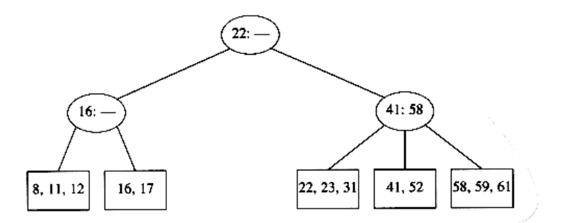
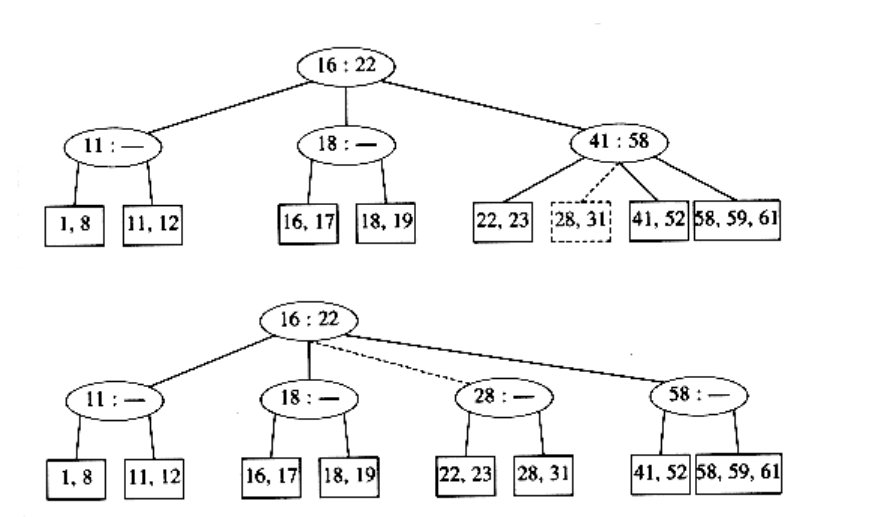

## B-Trees
Although all of the search trees we have seen so far are binary, there is a popular search tree that is not binary. This tree is known as a B-tree.

A B-tree of order m is a tree with the following structural properties:

- The root is either a leaf or has between 2 and m children.

- All nonleaf nodes (except the root) have between m/2 and m children.

- All leaves are at the same depth.

All data is stored at the leaves. Contained in each interior node are pointers p1, p2, . . . , pm to the children, and values k1, k2, . . . , km - 1, representing the smallest key found in the subtrees p2, p3, . . . , pm respectively. Of course, some of these pointers might be NULL, and the corresponding ki would then be undefined. For every node, all the keys in subtree p1 are smaller than the keys in subtree p2, and so on. The leaves contain all the actual data, which is either the keys themselves or pointers to records containing the keys. We will assume the former to keep our examples simple. There are various definitions of B-trees that change this structure in mostly minor ways, but this definition is one of the popular forms. We will also insist (for now) that the number of keys in a leaf is also between _m_/2 and m.

The tree in Figure 4.62 is an example of a B-tree of order 4.

**Figure 4.62 B-tree of order 4**

A B-tree of order 4 is more popularly known as a 2-3-4 tree, and a B-tree of order 3 is known as a 2-3 tree. We will describe the operation of B-trees by using the special case of 2-3 trees. Our starting point is the 2-3 tree that follows.

We have drawn interior nodes (nonleaves) in ellipses, which contain the two pieces of data for each node. A dash line as a second piece of information in an interior node indicates that the node has only two children. Leaves are drawn in boxes, which contain the keys. The keys in the leaves are ordered. To perform a find, we start at the root and branch in one of (at most) three directions, depending on the relation of the key we are looking for to the two (possibly one) values stored at the node.

To perform an insert on a previously unseen key, x, we follow the path as though we were performing a find. When we get to a leaf node, we have found the correct place to put x. Thus, to insert a node with key 18, we can just add it to a leaf without causing any violations of the 2-3 tree properties. The result is shown in the following figure.

Unfortunately, since a leaf can hold only two or three keys, this might not always be possible. If we now try to insert 1 into the tree, we find that the node where it belongs is already full. Placing our new key into this node would give it a fourth element which is not allowed. This can be solved by making two nodes of two keys each and adjusting the information in the parent.

Unfortunately, this idea does not always work, as can be seen by an attempt to insert 19 into the current tree. If we make two nodes of two keys each, we obtain the following tree.

This tree has an internal node with four children, but we only allow three per node. The solution is simple. We merely split this node into two nodes with two children. Of course, this node might be one of three children itself, and thus splitting it would create a problem for its parent (which would now have four children), but we can keep on splitting nodes on the way up to the root until we either get to the root or find a node with only two children. In our case, we can get by with splitting only the first internal node we see, obtaining the following tree.

If we now insert an element with key 28, we create a leaf with four children, which is split into two leaves of two children:

This creates an internal node with four children, which is then split into two children. What we have done here is split the root into two nodes. When we do this, we have a special case, which we finish by creating a new root. This is how (the only way) a 2-3 tree gains height.

Notice also that when a key is inserted, the only changes to internal nodes occur on the access path. These changes can be made in time proportional to the length of this path, but be forewarned that there are quite a few cases to handle, and it is easy to do this wrong.

There are other ways to handle the case where a node becomes overloaded with children, but the method we have described is probably the simplest. When attempting to add a fourth key to a leaf, instead of splitting the node into two we can first attempt to find a sibling with only two keys. For instance, to insert 70 into the tree above, we could move 58 to the leaf containing 41 and 52, place 70 with 59 and 61, and adjust the entries in the internal nodes. This strategy can also be applied to internal nodes and tends to keep more nodes full. The cost of this is slightly more complicated routines, but less space tends to be wasted.

We can perform deletion by finding the key to be deleted and removing it. If thiskey was one of only two keys in a node, then its removal leaves only one key. We can fix this by combining this node with a sibling. If the sibling has three keys, we can steal one and have both nodes with two keys. If the sibling has only two keys, we combine the two nodes into a single node with three keys. The parent of this node now loses a child, so we might have to percolate this strategy all the way to the top. If the root loses its second child, then the root is also deleted and the tree becomes one level shallower. As we combine nodes, we must remember to update the information kept at the internal nodes.

With general B-trees of order m, when a key is inserted, the only difficulty arises when the node that is to accept the key already has m keys. This key gives the node m + 1 keys, which we can split into two nodes with (m + 1) / 2 and (m + 1) / 2 keys respectively. As this gives the parent an extra node, we have to check whether this node can be accepted by the parent and split the parent if it already has m children. We repeat this until we find a parent with less than m children. If we split the root, we create a new root with two children.

The depth of a B-tree is at most log m/2 n . At each node on the path, we perform O(log m) work to determine which branch to take (using a binary search), but an insert or delete could require O(m) work to fix up all the information at the node. The worst-case running time for each of the insert and delete operations is thus O(m logm n) = O((m / log m) log n), but a find takes only O(log n). The best (legal) choice of m for running time considerations has been shown empirically to be either m = 3 or m = 4; this agrees with the bounds above, which show that as m gets larger, the insertion and deletion times increase. If we are only concerned with main memory speed, higher order B-trees, such as 5-9 trees, are not an advantage.

The real use of B-trees lies in database systems, where the tree is kept on a physical disk instead of main memory. Accessing a disk is typically several orders of magnitude slower than any main memory operation. If we use a B-tree of order m, then the number of disk accesses is O(logm n). Although each disk access carries the overhead of O(log m) to determine the direction to branch, the time to perform this computation is typically much smaller than the time to read a block of memory and can thus be considered inconsequential (as long as m is chosen reasonably). Even if updates are performed and O(m) computing time is required at each node, this too is generally not significant. The value of m is then chosen to be the largest value that still allows an interior node to fit into one disk block, and is typically in the range 32 m 256. The maximum number of elements that are stored in a leaf is chosen so that if the leaf is full, it fits in one block. This means that a record can always be found in very few disk accesses, since a typical B-tree will have a depth of only 2 or 3, and the root (and possibly the first level) can be kept in main memory.

Analysis suggests that a B-tree will be ln 2 = 69 percent full. Better space utilization can be obtained if, instead of always splitting a node when the tree obtains its (m + 1)th entry, the routine searches for a sibling that can take theextra child. The details can be found in the references.
