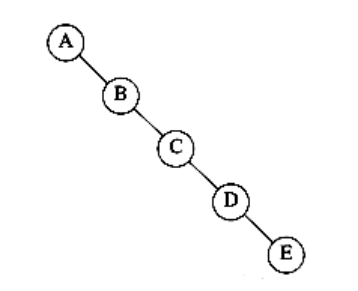
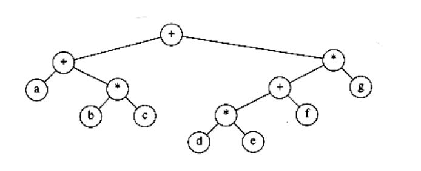
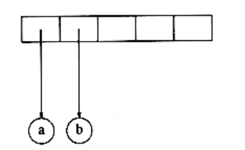
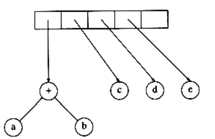
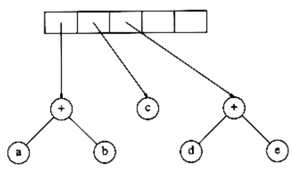
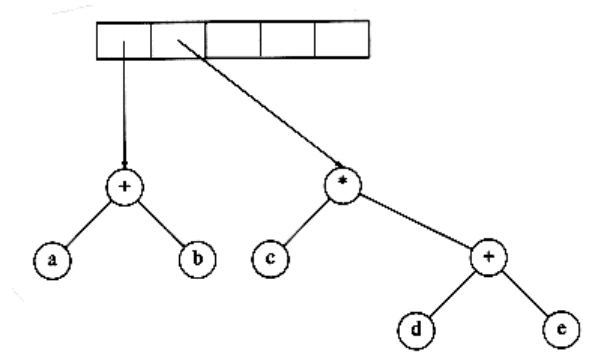
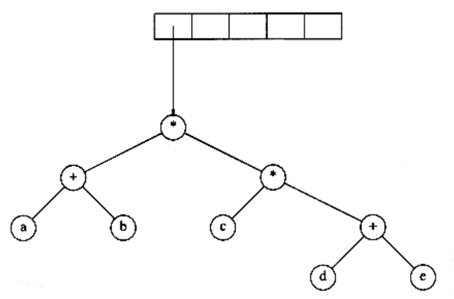

## Binary Trees

A binary tree is a tree in which no node can have more than two children.

Figure 4.11 shows that a binary tree consists of a root and two subtrees, Tl and Tr, both of which could possibly be empty.

A property of a binary tree that is sometimes important is that the depth of an average binary tree is considerably smaller than n. An analysis shows that the average depth is , and that for a special type of binary tree, namely the binary search tree, the average value of the depth is O(log n). Unfortunately, the depth can be as large as n -1, as the example in Figure 4.12 shows.

**Figure 4.11 Generic binary tree**

**Figure 4.12 Worst-case binary tree**

### Implementation

Because a binary tree has at most two children, we can keep direct pointers to them. The declaration of tree nodes is similar in structure to that for doubly linked lists, in that a node is a structure consisting of the key information plus two pointers (left and right) to other nodes see Many of the rules that apply to linked lists will apply to trees as well. In particular, when an insertion is performed, a node will have to be created by a call to malloc. Nodes can be freed after deletion by calling free.

```c
typedef struct tree_node *tree_ptr;

struct tree_node
{

element_type element;tree_ptr left;

tree_ptr right;

};

typedef tree_ptr TREE;
```
**Figure 4.13 Binary tree node declarations**

We could draw the binary trees using the rectangular boxes that are customary for linked lists, but trees are generally drawn as circles connected by lines, because they are actually graphs. We also do not explicitly draw NULL pointers when referring to trees, because every binary tree with n nodes would require n + 1 NULL pointers.

Binary trees have many important uses not associated with searching. One of the principal uses of binary trees is in the area of compiler design, which we will now explore.

### Expression Trees

Figure 4.14 shows an example of an expression tree. The leaves of an expression tree are operands, such as constants or variable names, and the other nodes contain operators. This particular tree happens to be binary, because all of the operations are binary, and although this is the simplest case, it is possible for nodes to have more than two children. It is also possible for a node to have only one child, as is the case with the unary minus operator. We can evaluate an expression tree, T, by applying the operator at the root to the values obtained by recursively evaluating the left and right subtrees. In our example, the left subtree evaluates to a + (b * c) and the right subtree evaluates to ((d *e) + f) *g. The entire tree therefore represents (a + (b*c)) + (((d * e) + f)* g).

We can produce an (overly parenthesized) infix expression by recursively producing a parenthesized left expression, then printing out the operator at the root, and finally recursively producing a parenthesized right expression. This general strattegy (left, node, right) is known as an inorder traversal; it is easy to remember because of the type of expression it produces.

An alternate traversal strategy is to recursively print out the left subtree, the right subtree, and then the operator. If we apply this strategy to our tree above, the output is a b c * + d e * f + g * +, which is easily seen to be the postfix representation of Section 3.3.3. This traversal strategy is generally known as a postorder traversal. We have seen this traversal strategy earlier in Section 4.1.


**Figure 4.14 Expression tree for (a + b * c) + ((d * e + f) * g)**

A third traversal strategy is to print out the operator first and then recursively print out the left and right subtrees. The resulting expression, + + a * b c * + * d e f g, is the less useful prefix notation and the traversal strategy is a preorder traversal, which we have also seen earlier in Section 4.1. We will return to these traversal strategies once again later in the chapter.

**Constructing an Expression Tree**

We now give an algorithm to convert a postfix expression into an expression tree. Since we already have an algorithm to convert infix to postfix, we can generate expression trees from the two common types of input. The method we describe strongly resembles the postfix evaluation algorithm of Section 3.2.3. We read our expression one symbol at a time. If the symbol is an operand, we create a one- node tree and push a pointer to it onto a stack. If the symbol is an operator, we pop pointers to two trees *T1* and *T2* from the stack (T1 is popped first) and form a new tree whose root is the operator and whose left and right children point to *T2* and *T1* respectively. A pointer to this new tree is then pushed onto the stack.

As an example, suppose the input is a b + c d e + * *

The first two symbols are operands, so we create one-node trees and push pointers to them onto a stack.*

*For convenience, we will have the stack grow from left to right in the diagrams.



Next, a '+' is read, so two pointers to trees are popped, a new tree is formed,


and a pointer to it is pushed onto the stack.*

Next, c, d, and e are read, and for each a one-node tree is created and a pointer to the corresponding tree is pushed onto the stack.



Now a '+' is read, so two trees are merged.



Continuing, a '\*' is read, so we pop two tree pointers and form a new tree with a '*' as root.
  


Finally, the last symbol is read, two trees are merged, and a pointer to the final tree is left on the stack.

