## Splay Trees

We now describe a relatively simple data structure, known as a splay tree, that guarantees that any m consecutive tree operations take at most O(m log n) time.Although this guarantee does not preclude the possibility that any single operation might take O(n) time, and thus the bound is not as strong as an O(log n) worst-case bound per operation, the net effect is the same: There are no bad input sequences. Generally, when a sequence of m operations has total worst-case running time of O(m f(n)), we say that the amortized running time is O(f(n)). Thus, a splay tree has O(log n) amortized cost per operation. Over a long sequence of operations, some may take more, some less.

Splay trees are based on the fact that the O(n) worst-case time per operation for binary search trees is not bad, as long at it occurs relatively infrequently. Any one access, even if it takes O(n), is still likely to be extremely fast. The problem with binary search trees is that it is possible, and not uncommon, for a whole sequence of bad accesses to take place. The cumulative running time then becomes noticeable. A search tree data structure with O(n) worst-case time, but a guarantee of at most O(m log n) for any m consecutive operations, is certainly satisfactory, because there are no bad sequences.

If any particular operation is allowed to have an O(n) worst-case time bound, and we still want an O(log n) amortized time bound, then it is clear that whenever a node is accessed, it must be moved. Otherwise, once we find a deep node, we could keep performing finds on it. If the node does not change location, and each access costs O(n), then a sequence of m accesses will cost O(m n).
```c
SEARCH_TREE

insert(element_type x, SEARCH_TREE T)
{

return insert1(x, T, NULL);

}

SEARCH_TREE

insert1(element_type x, SEARCH_TREE T, avl_ptr parent)
{

avl_ptr rotated_tree;

if(T == NULL){ /* Create and return a one-node tree */

T = (SEARCH_TREE) malloc (sizeof (struct avl_node));

if(T == NULL)
fatal_error("Out of space!!!");

else{T->element = x; T->height = 0;

T->left = T->right = NULL;

}

}

else{

if(x < T->element){

T->left = insert1(x, T->left, T);

if(height(T->left) - height(T->right)) == 2
{

if(x < T->left->element)
rotated_tree = s_rotate_left(T);

else
rotated_tree = d_rotate_left(T);

if(parent->left == T)
parent->left = rotated_tree;

else
parent->right = rotated_tree;

}

else
T->height = max(height(T->left), height(T->right)) + 1;

}

else
/* Symmetric Case for right subtree */;

/* Else x is in the tree already. We'll do nothing */

}

return T;

}
```
**Figure 4.37 Insertion into an AVL tree**

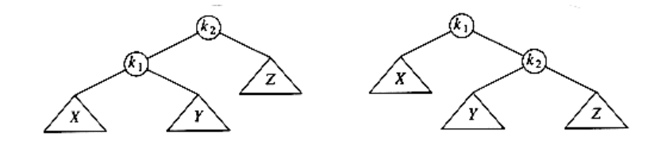

**Figure 4.38**
```c
/* This function can be called only if k2 has a left child. */

/* Perform a rotate between a node (k2) and its left child. */

/* Update heights. */

/* Then return new root. */

avl_ptr

s_rotate_left(avl_ptr k2)
{

avl_ptr k1;

k1 = k2->left;

k2->left = k1->right;

k1->right = k2;

k2->height = max(height(k2->left), height(k2->right)) + 1;

k1->height = max(height(k1->left), k2->height) + 1;

return k1; /* New root */

}
```
**Figure 4.39 Routine to perform single rotation**

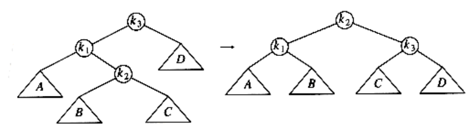

**Figure 4.40**
```c
/* This function can be called only if k3 has a left child */

/* and k3's left child has a right child */

/* Do the left-right double rotation. Update heights */

avl_ptr

d_rotate_left(avl_ptr k3)
{

/* rotate between k1 and k2 */

k3->left = s_rotate_right(k3->left);

/* rotate between k3 and k2 */

return(s_rotate_left(k3));

}
```
**Figure 4.41 Routine to perform double rotation**

The basic idea of the splay tree is that after a node is accessed, it is pushed to the root by a series of **AVL** tree rotations. Notice that if a node is deep, there are many nodes on the path that are also relatively deep, and by restructuring we can make future accesses cheaper on all these nodes. Thus, if the node is unduly deep, then we want this restructuring to have the side effect of balancing the tree (to some extent). Besides giving a good time bound in theory, this method is likely to have practical utility, because in many applications when a node is accessed, it is likely to be accessed again in the near future. Studies have shown that this happens much more often than one would expect. Splay trees also do not require the maintenance of height or balance information, thus saving space and simplifying the code to some extent (especially when careful implementations are written).

### A Simple Idea (That Does Not Work)

One way of performing the restructuring described above is to perform single rotations, bottom up. This means that we rotate every node on the access path with its parent. As an example, consider what happens after an access (a find) on k1 in the following tree.

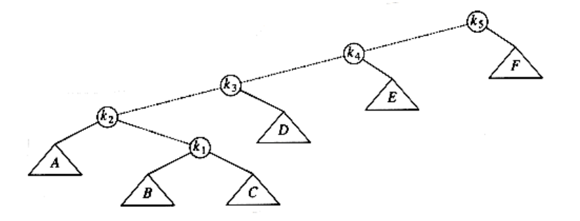

The access path is dashed. First, we would perform a single rotation between k1  and its parent, obtaining the following tree.

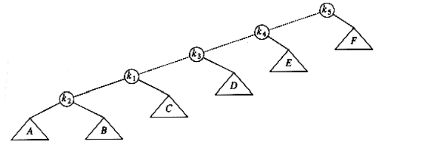

Then, we rotate between k1 and k3, obtaining the next tree.

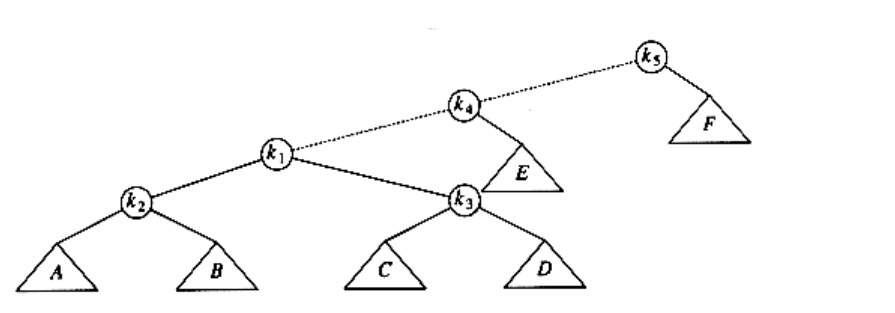

Then two more rotations are performed until we reach the root.

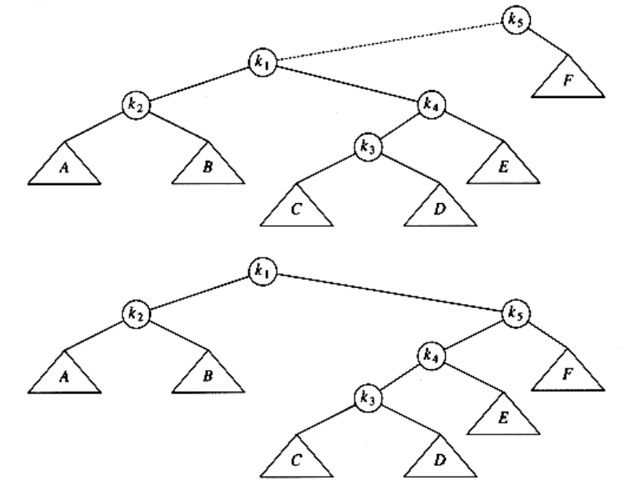

These rotations have the effect of pushing k1 all the way to the root, so that future accesses on k1 are easy (for a while). Unfortunately, it has pushed another node (k3) almost as deep as k1 used to be. An access on that node will then push another node deep, and so on. Although this strategy makes future accesses of k1 cheaper, it has not significantly improved the situation for the other nodes on the (original) access path. It turns out that it is possible to prove that using this strategy, there is a sequence of m operations requiring

(m n) time, so this idea is not quite good enough. The simplest way to show this is to consider the tree formed by inserting keys 1, 2, 3, . . . , n into an initially empty tree (work this example out). This gives a tree consisting of only left children. This is not necessarily bad, though, since the time to build this tree is O(n) total. The bad part is that accessing the node with key 1 takes n -1 units of time. After the rotations are complete, an access of the node with key 2 takes n - 2 units of time. The total for accessing all the keys in order is . After they are accessed, the tree reverts to its original state, and we can repeat the sequence.

### Splaying

The splaying strategy is similar to the rotation idea above, except that we are a little more selective about how rotations are performed. We will still rotate bottom up along the access path. Let x be a (nonroot) node on the access path at which we are rotating. If the parent of x is the root of the tree, we merely rotate x and the root. This is the last rotation along the access path. Otherwise, x has both a parent (p) and a grandparent (g), and there are twocases, plus symmetries, to consider. The first case is the zig-zag case (see Fig. 4.42). Here x is a right child and p is a left child (or vice versa). If this is the case, we perform a double rotation, exactly like an AVL double rotation. Otherwise, we have a zig-zig case: x and p are either both left children or both right children. In that case, we transform the tree on the left of Figure 4.43 to the tree on the right.

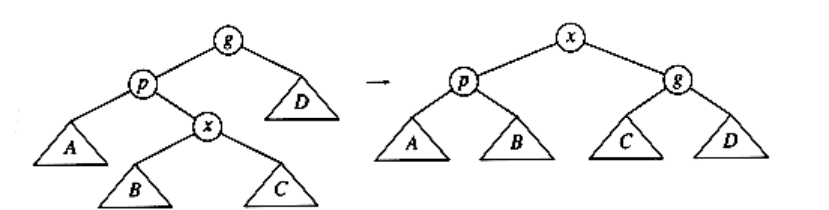

**Figure 4.42 Zig-zag**

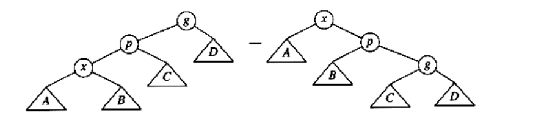

**Figure 4.43 Zig-zig**

As an example, consider the tree from the last example, with a find on k1:

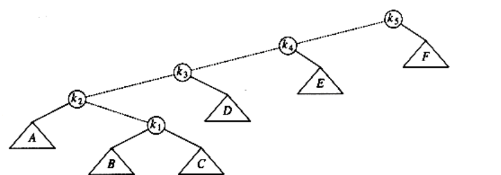

The first splay step is at k1, and is clearly a zig-zag, so we perform a standard **AVL** double rotation using k1, k2, and k3. The resulting tree follows.

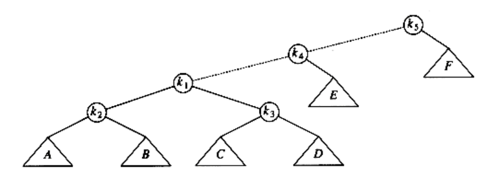

The next splay step at k1 is a zig-zig, so we do the zig-zig rotation with k1,k4, and k5, obtaining the final tree.

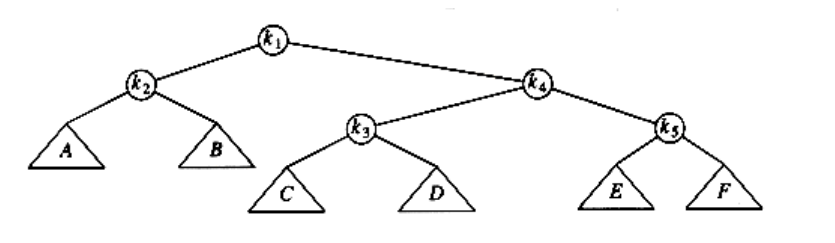

Although it is hard to see from small examples, splaying not only moves the accessed node to the root, but also has the effect of roughly halving the depth of most nodes on the access path (some shallow nodes are pushed down at most two levels).

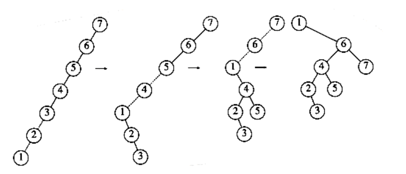


**Figure 4.44 Result of splaying at node 1**

To see the difference that splaying makes over simple rotation, consider again the effect of inserting keys 1, 2, 3, . . . , n into an initially empty tree. This takes a total of O(n), as before, and yields the same tree as simple rotations. Figure 4.44 shows the result of splaying at the node with key 1. The difference is that after an access of the node with key 1, which takes n -1 units, the access on the node with key 2 will only take about n/2 units instead of n - 2 units; there are no nodes quite as deep as before.

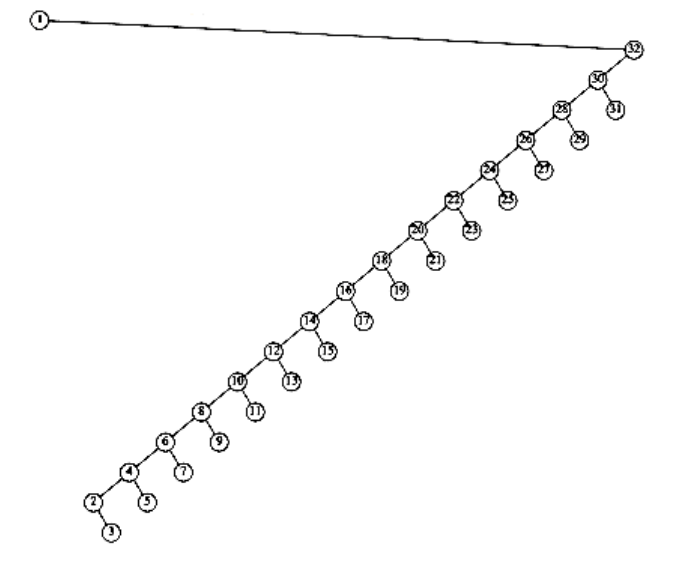


**Figure 4.45 Result of splaying at node 1 a tree of all left children**

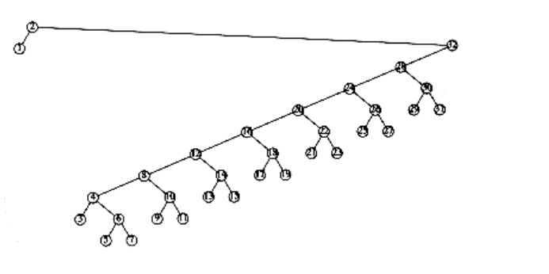


**Figure 4.46 Result of splaying previous tree at node 2**

An access on the node with key 2 will bring nodes to within n/4 of the root, and this is repeated until the depth becomes roughly log n (an example with n = 7 is too small to see the effect well). Figures 4.45 to 4.53 show the result of accessing keys 1 through 9 in a 32-node tree that originally contains only left children. Thus we do not get the same bad behavior from splay trees that is prevalent in the simple rotation strategy. (Actually, this turns out to be a very good case. A rather complicated proof shows that for this example, the n accesses take a total of O(n) time).

These figures show off the fundamental and crucial property of splay trees. When access paths are long, thus leading to a longer-than-normal search time, the rotations tend to be good for future operations. When accesses are cheap, the rotations are not as good and can be bad. The extreme case is the initial tree formed by the insertions. All the insertions were constant-time operations leading to a bad initial tree. At that point in time, we had a very bad tree, butwe were running ahead of schedule and had the compensation of less total running time. Then a couple of really horrible accesses left a nearly balanced tree, but the cost was that we had to give back some of the time that had been saved. The main theorem, which we will prove in Chapter 11, is that we never fall behind a pace of O(log n) per operation: We are always on schedule, even though there are occasionally bad operations.

Because the rotations for splay trees are performed in pairs from the bottom up, a recursive implementation does not work, (although modifications to the splaying steps can be made to allow a recursive implementation). The pairs of nodes to consider are not known until the length of the path is determined to be even or odd. Thus, splay trees are coded nonrecursively and work in two passes. The first pass goes down the tree and the second goes back up, performing rotations. This requires that the path be saved. This can be done by using a stack (which might need to store n pointers) or by adding an extra field to the node record that will point to the parent. Neither method is particularly difficult to implement. We will provide code for the splaying routine on the assumption that each node stores its parent.

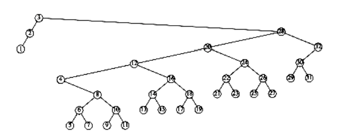


**Figure 4.47 Result of splaying previous tree at node 3**

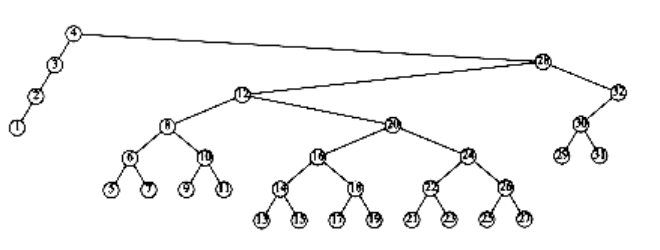

**Figure 4.48 Result of splaying previous tree at node 4**

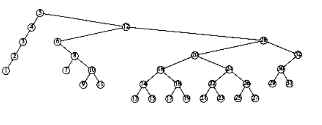

**Figure 4.49 Result of splaying previous tree at node 5**

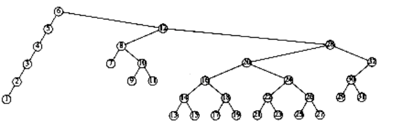

**Figure 4.50 Result of splaying previous tree at node 6**

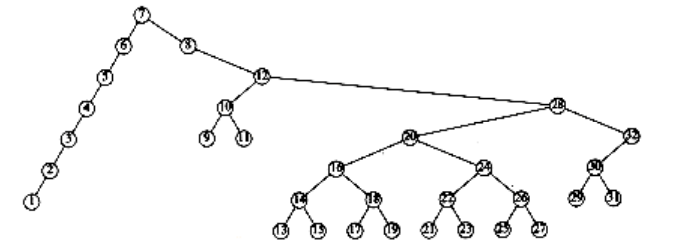

**Figure 4.51 Result of splaying previous tree at node 7**
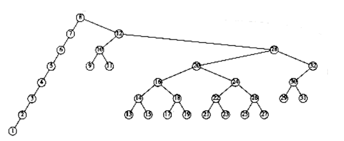

**Figure 4.52 Result of splaying previous tree at node 8**

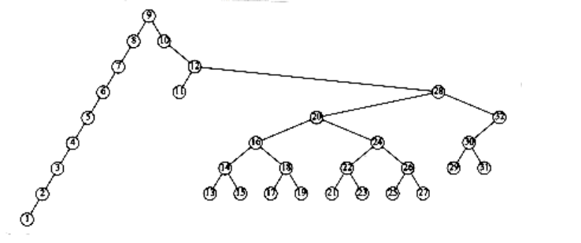

**Figure 4.53 Result of splaying previous tree at node 9**

The type declarations (Fig. 4.54) are simple to understand. The splaying routine (Fig. 4.55) takes as argument the last node on the accessed path and makes it the new root. The routines single_rotate and double_rotate choose the correct type of rotation. We provide the code for single_rotate in Figure 4.56.

The rotation routines are similar to the AVL rotations, except that the parent pointers must be maintained. Some sample routines are in the figures that follow. Since zig rotations always make x the new root, we know that x will have no parent after the operation. The code for this is in Figure 4.57.

Zig-zigs and Zig-zags are similar. We will write the one routine to perform the zig-zig splay when both x and p are left children. One way to do this is to write a single_rotate routine that includes pointer changes for the parent, and then implement the complex rotations with two single rotations. This is the way we coded the AVL routines. We have taken a different approach in Figure 4.58 to show the diversity of styles available. See Figure 4.59. You should try to code the other cases yourself; it will be excellent pointer manipulation practice.
```c
typedef struct splay_node *splay_ptr;

struct splay_node
{

element_type element;

splay_ptr left;

splay-ptr right;

splay-ptr parent;

};

typedef splay_ptr SEARCH_TREE;
```
**Figure 4.54 Type declarations for splay trees**
```c
void splay(splay_ptr current)
{

splay_ptr father;

father = current->parent;

while(father != NULL)
{

if(father->parent == NULL)
single_rotate (current);else
double_rotate(current);

father = current->parent;

}

}
```
**Figure 4.55 Basic splay routine**
```c
void single_rotate(splay_ptr x)
{

if(x->parent->left == x)
zig_left(x);

else
zig_right(x);

}
```
**Figure 4.56 Single rotation**
```c
void zig_left(splay_ptr x)
{

splay ptr p, B;

p = x->parent;

B = x->right;

x->right = p; /* x's new right child is p*/

x->parent = NULL; /* x will now be a root */

if(B != NULL)
B->parent = p;

p->left = B;

p->parent = x;

}
```
**Figure 4.57 Single rotation between root and its left child**

We can perform deletion by accessing the node to be deleted. This puts the node at the root. If it is deleted, we get two subtrees TL and TR (left and right). If we find the largest element in TL (which is easy), then this element is rotated to the root of TL, and TL will now have a root with no right child. We can finish the deletion by making TR the right child.

The analysis of splay trees is difficult, because it must take into account the ever-changing structure of the tree. On the other hand, splay trees are much simpler to program than AVL trees, since there are fewer cases to consider and no balance information to maintain. Our splay tree code may look complicated, but as pointed out before, it can be simplified; it is probably much simpler than a nonrecursive AVL implementation. Some empirical evidence suggests that this translates into faster code in practice, although the case for this is far from complete. Finally, we point out that there are several variations of splay trees that can perform even better in practice.

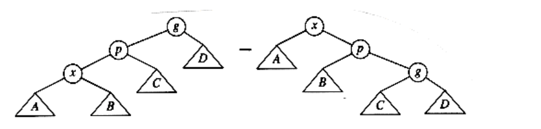
```c
Figure 4.58

void zig_zig_left(splay_ptr x)
{

splay_ptr p, g, B, C, ggp;

p = x->parent;

g = p->parent;

B = x->right;

C = p->right;

ggp = g->parent;

x->right = p; /* x's new right child is p*/

p->parent = x;

p->right = g; /* p's new right child is g */

g->parent = p;if(B != NULL) /* p's new left child is subtree B */

B->parent = p;

p->left = B;

if(C != NULL) /* g's new left child is subtree C */

C->parent = g;

g->left = C;

x->parent = ggp; /* connect to rest of the tree */

if(ggp ! = NULL)
if(gpp->left == g)
ggp->left = x;

else
ggp->right = x;

}
```
**Figure 4.59 Routine to perform a zig-zig when both children are initially left children**
