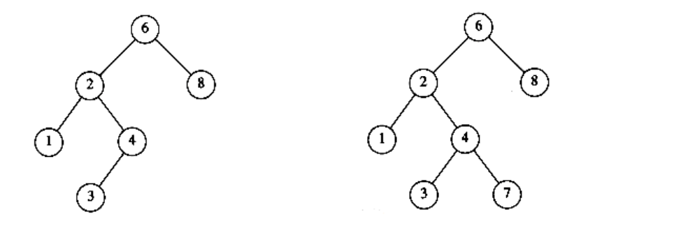
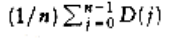
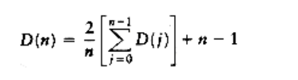
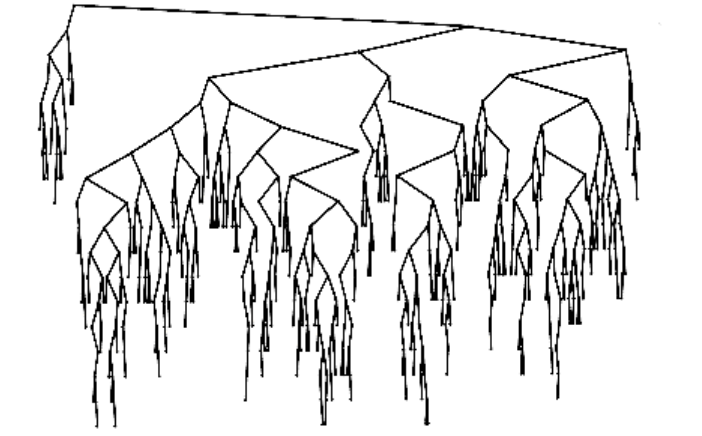
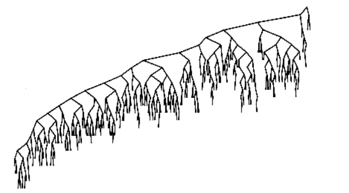

## The Search Tree ADT-Binary Search Trees

An important application of binary trees is their use in searching. Let us assume that each node in the tree is assigned a key value. In our examples, we will assume for simplicity that these are integers, although arbitrarily complex keys are allowed. We will also assume that all the keys are distinct, and deal with duplicates later.

The property that makes a binary tree into a binary search tree is that for every node, X, in the tree, the values of all the keys in the left subtree are smaller than the key value in X, and the values of all the keys in the right subtree are larger than the key value in X. Notice that this implies that all the elements in the tree can be ordered in some consistent manner. In Figure 4.15, the tree on the left is a binary search tree, but the tree on the right is not. The tree on the right has a node with key 7 in the left subtree of a node with key 6 (which happens to be the root).

We now give brief descriptions of the operations that are usually performed on binary search trees. Note that because of the recursive definition of trees, it is common to write these routines recursively. Because the average depth of a binary search tree is O(log n), we generally do not need to worry about running out of stack space. We repeat our type definition in Figure 4.16. Since all the elements can be ordered, we will assume that the operators <, >, and = can be applied to them, even if this might be syntactically erroneous for some types.



**Figure 4.15 Two binary trees (only the left tree is a search tree)**
```c
typedef struct tree_node *tree_ptr;

struct tree_node{

element_type element;

tree_ptr left;

tree_ptr right;

};

typedef tree_ptr SEARCH_TREE;
```
**Figure 4.16 Binary search tree declarations**

### Make_null

This operation is mainly for initialization. Some programmers prefer to initialize the first element as a one-node tree, but our implementation follows the recursive definition of trees more closely. It is also a simple routine, as evidenced by Figure 4.17.

### Find

This operation generally requires returning a pointer to the node in tree T that has key x, or NULL if there is no such node. The structure of the tree makes this simple. If T is , then we can just return . Otherwise, if the key stored at T is x, we can return T. Otherwise, we make a recursive call on a subtree of T, either left or right, depending on the relationship of x to the key stored in T. The code in Figure 4.18 is an implementation of this strategy.
```c
SEARCH_TREE

make_null (void)
{

return NULL;

}
```
**Figure 4.17 Routine to make an empty tree**
```c
tree_ptr

find(element_type x, SEARCH_TREE T)
{

if(T == NULL)
return NULL;

if(x < T->element)
return(find(x, T->left));

else
if(x > T->element)
return(find(x, T->right));

else
return T;

}
```
**Figure 4.18 Find operation for binary search trees**

Notice the order of the tests. It is crucial that the test for an empty tree be performed first, since otherwise the indirections would be on a NULL pointer. The remaining tests are arranged with the least likely case last. Also note that both recursive calls are actually tail recursions and can be easily removed with an assignment and a goto. The use of tail recursion is justifiable here because the simplicity of algorithmic expression compensates for the decrease in speed, and the amount of stack space used is expected to be only O(log n).

### Find_min and find_max

These routines return the position of the smallest and largest elements in the tree, respectively. Although returning the exact values of these elements might seem more reasonable, this would be inconsistent with the find operation. It is important that similar-looking operations do similar things. To perform a find_min, start at the root and go left as long as there is a left child. The stopping point is the smallest element. The find_max routine is the same, except that branching is to the right child.

This is so easy that many programmers do not bother using recursion. We will code the routines both ways by doing find_min recursively and find_max nonrecursively (see Figs. 4.19 and 4.20).

Notice how we carefully handle the degenerate case of an empty tree. Although this is always important to do, it is especially crucial in recursive programs. Also notice that it is safe to change T in find_max, since we are only working with a copy. Always be extremely careful, however, because a statement such as T -> right : =T -> right -> right will make changes in most languages.
```c
tree_ptr

find_min(SEARCH_TREE T)
{

if(T == NULL)
return NULL;

else
if(T->left == NULL)
return(T);

else
return(find_min (T->left));

}
```
**Figure 4.19 Recursive implementation of find_min for binary search trees**
```c
tree_ptr

find_max(SEARCH_TREE T)
{

if(T != NULL)
while(T->right != NULL)

T = T->right;

return T;}
```
**Figure 4.20 Nonrecursive implementation of find_max for binary search trees**

### Insert

The insertion routine is conceptually simple. To insert x into tree T, proceed down the tree as you would with a find. If x is found, do nothing (or "update" something). Otherwise, insert x at the last spot on the path traversed. Figure 4.21 shows what happens. To insert 5, we traverse the tree as though a find were occurring. At the node with key 4, we need to go right, but there is no subtree, so 5 is not in the tree, and this is the correct spot.

Duplicates can be handled by keeping an extra field in the node record indicating the frequency of occurrence. This adds some extra space to the entire tree, but is better than putting duplicates in the tree (which tends to make the tree very deep). Of course this strategy does not work if the key is only part of a larger record. If that is the case, then we can keep all of the records that have the same key in an auxiliary data structure, such as a list or another search tree.


**Figure 4.21 Binary search trees before and after inserting 5**

Figure 4.22 shows the code for the insertion routine. Since T points to the root of the tree, and the root changes on the first insertion, insert is written as a function that returns a pointer to the root of the new tree. Lines 8 and 10 recursively insert and attach x into the appropriate subtree.
```c
tree_ptr

insert(element_type x, SEARCH_TREE T)
{

/*1*/ if(T == NULL){ /* Create and return a one-node tree */

/*2*/ T = (SEARCH_TREE) malloc (sizeof (struct tree_node));

/*3*/ if(T == NULL)/*4*/ fatal_error("Out of space!!!");

else{

/*5*/ T->element = x;

/*6*/ T->left = T->right = NULL;

}

}

else
/*7*/ if(x < T->element)
/*8*/ T->left = insert(x, T->left);

else
/*9*/ if(x > T->element)
/*10*/ T->right = insert(x, T->right);

/* else x is in the tree already. We'll do nothing */

/*11*/ return T; /* Don't forget this line!! */

}
```
**Figure 4.22 Insertion into a binary search tree**

### Delete

As is common with many data structures, the hardest operation is deletion. Once we have found the node to be deleted, we need to consider several possibilities.

If the node is a leaf, it can be deleted immediately. If the node has one child, the node can be deleted after its parent adjusts a pointer to bypass the node (we will draw the pointer directions explicitly for clarity). See Figure 4.23. Notice that the deleted node is now unreferenced and can be disposed of only if a pointer to it has been saved.

The complicated case deals with a node with two children. The general strategy is to replace the key of this node with the smallest key of the right subtree (which is easily found) and recursively delete that node (which is now empty). Because the smallest node in the right subtree cannot have a left child, the second delete is an easy one. Figure 4.24 shows an initial tree and the result of a deletion. The node to be deleted is the left child of the root; the key value is 2. It is replaced with the smallest key in its right subtree (3), and then that node is deleted as before.


**Figure 4.23 Deletion of a node (4) with one child, before and after**


**Figure 4.24 Deletion of a node (2) with two children, before and after**

The code in Figure 4.25 performs deletion. It is inefficient, because it makes two passes down the tree to find and delete the smallest node in the right subtree when this is appropriate. It is easy to remove this inefficiency, by writing a special delete_min function, and we have left it in only for simplicity.

If the number of deletions is expected to be small, then a popular strategy to use is lazy deletion: When an element is to be deleted, it is left in the tree and merely marked as being deleted. This is especially popular if duplicate keys are present, because then the field that keeps count of the frequency of appearance can be decremented. If the number of real nodes in the tree is the same as the number of "deleted" nodes, then the depth of the tree is only expected to go up by a small constant (why?), so there is a very small time penalty associated with lazy deletion. Also, if a deleted key is reinserted, the overhead of allocating a new cell is avoided.
```c
tree_ptr

delete(element_type x, SEARCH_TREE T)
{

tree_ptr tmp_cell, child;

if(T == NULL)
error("Element not found");

else
if(x < T->element) /* Go left */

T->left = delete(x, T->left);

else
if(x > T->element) /* Go right */

T->right = delete(x, T->right);

else /* Found element to be deleted */

if(T->left && T->right) /* Two children */
{ /* Replace with smallest in right subtree */

tmp_cell = find_min(T->right);

T->element = tmp_cell->element;

T->right = delete(T->element, T->right);

}

else /* One child */

}

tmp_cell = T;

if(T->left == NULL) /* Only a right child */

child = T->right;

if(T->right == NULL) /* Only a left child */

child = T->left;

free(tmp_cell);

return child;

}

return T;

}
```
**Figure 4.25 Deletion routine for binary search trees**

### Average-Case Analysis

Intuitively, we expect that all of the operations of the previous section, except make_null, should take O(log n) time, because in constant time we descend a level in the tree, thus operating on a tree that is now roughly half as large. Indeed, the running time of all the operations, except make_null, is O(d), where d is the depth of the node containing the accessed key.

We prove in this section that the average depth over all nodes in a tree is O(log n) on the assumption that all trees are equally likely.

The sum of the depths of all nodes in a tree is known as the internal path length. We will now calculate the average internal path length of a binary search tree, where the average is taken over all possible binary search trees.

Let D(n) be the internal path length for some tree T of n nodes. D(1) = 0. An n- node tree consists of an i-node left subtree and an (n - i - 1)-node right

subtree, plus a root at depth zero for 0 i < n. D(i) is the internal path length of the left subtree with respect to its root. In the main tree, all these nodes are one level deeper. The same holds for the right subtree. Thus, we get the recurrence

D(n) = D(i) + D(n - i -1) + n -1

If all subtree sizes are equally likely, which is true for binary search trees (since the subtree size depends only on the relative rank of the first element inserted into the tree), but not binary trees, then the average value of both D

(i) and D(n - i -1) is    . This yields



This recurrence will be encountered and solved in Chapter 7, obtaining an average value of D(n) = O(n log n). Thus, the expected depth of any node is O(log n). As an example, the randomly generated 500-node tree shown in Figure 4.26 has nodes at expected depth 9.98.

It is tempting to say immediately that this result implies that the average running time of all the operations discussed in the previous section is O(log n), but this is not entirely true. The reason for this is that because of deletions, it is not clear that all binary search trees are equally likely. In particular, the deletion algorithm described above favors making the left subtrees deeper than the right, because we are always replacing a deleted node with a node from the right subtree. The exact effect of this strategy is still unknown, but it seems only to be a theoretical novelty. It has been shown that if we alternate insertions and deletions (n2) times, then the trees will have an expected depth of . After a quarter-million random insert/delete pairs, the tree that was somewhat right-heavy in Figure 4.26 looks decidedly unbalanced (averagedepth = 12.51). See Figure 4.27.



**Figure 4.26 A randomly generated binary search tree**

We could try to eliminate the problem by randomly choosing between the smallest element in the right subtree and the largest in the left when replacing the deleted element. This apparently eliminates the bias and should keep the trees balanced, but nobody has actually proved this. In any event, this phenomenon appears to be mostly a theoretical novelty, because the effect does not show up at all for small trees, and stranger still, if o(n2) insert/delete pairs are used, then the tree seems to gain balance!



**Figure 4.27 Binary search tree after O(n2) insert/delete pairs**

The main point of this discussion is that deciding what "average" means is generally extremely difficult and can require assumptions which may or may not be valid. In the absence of deletions, or when lazy deletion is used, it can be shown that all binary search trees are equally likely and we can conclude that the average running times of the operations above are O(log n). Except forstrange cases like the one discussed above, this result is very consistent with observed behavior.

If the input comes into a tree presorted, then a series of inserts will take quadratic time and give a very expensive implementation of a linked list, since the tree will consist only of nodes with no left children. One solution to the problem is to insist on an extra structural condition called balance: no node is allowed to get too deep.

There are quite a few general algorithms to implement balanced trees. Most are quite a bit more complicated than a standard binary search tree, and all take longer on average. They do, however, provide protection against the embarrassingly simple cases. Below, we will sketch one of the oldest forms of balanced search trees, the **AVL** tree.

A second, newer, method is to forego the balance condition and allow the tree to be arbitrarily deep, but after every operation, a restructuring rule is applied that tends to make future operations efficient. These types of data structures are generally classified as self-adjusting. In the case of a binary search tree, we can no longer guarantee an O(log n) bound on any single operation, but can show that any sequence of m operations takes total time O(m log n) in the worst case. This is generally sufficient protection against a bad worst case. The data structure we will discuss is known as a splay tree; its analysis is fairly intricate and is discussed in Chapter 11.
